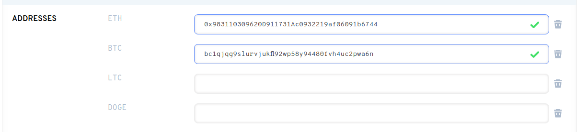

# Add other wallet addresses to your ENS name.

Setting a non-Ethereum address to your name allows dApps that support ENS to use your Ethereum Name to connect to other cryptocurrency addresses. You can set up non-ETH addresses in the domain manager on [https://app.ens.domains](https://app.ens.domains/).

We recommend setting multiple addresses at once to save on gas fees. Adding or removing cryptocurrencies will incur a gas fee signing request.

### How can I add other wallets?

In the ENS Manager, you can add a cryptocurrency address by copying and pasting your cryptocurrency address in the corresponding address field.

If your coin type is not listed in the pre-existing fields, find the coin dropdown menu and select your currency. Click `ADD/EDIT RECORD`.

When you have entered all of your desired cryptocurrency, or have made changes to your other records, scroll down to the bottom of the manager page.

**Important:** To permanently make these changes, you must select the "Confirm" button. This will change the on-chain data and will incur a gas fee.

