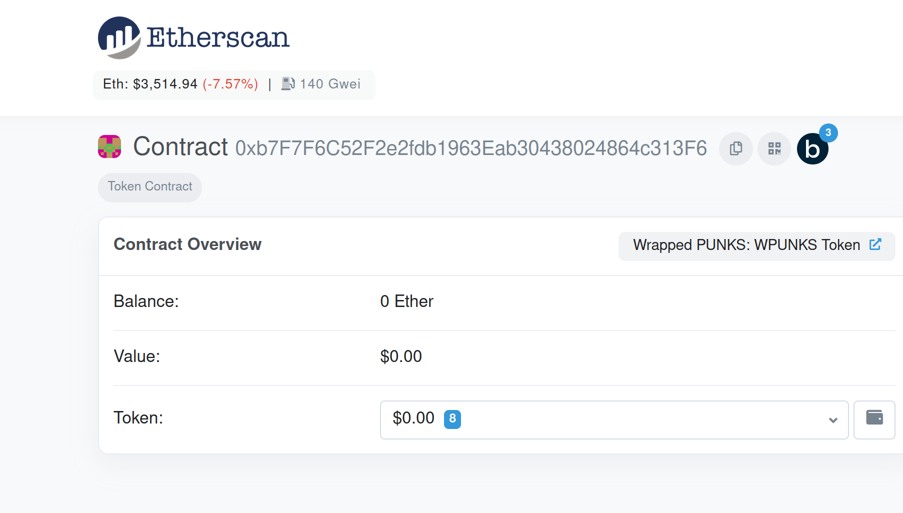
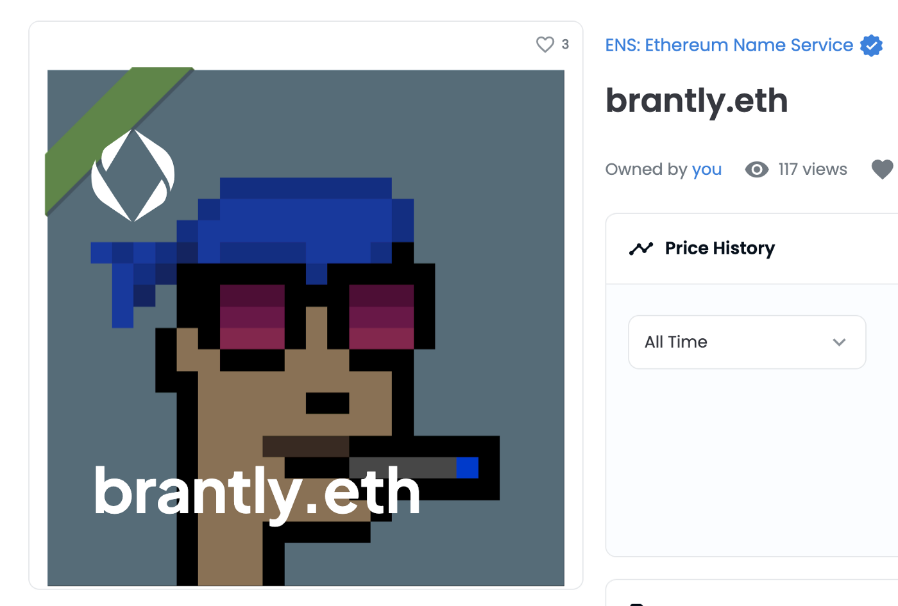

# Setting your Profile Avatar

**WARNING**: Support in the ENS Manager right now is very manual! A redesign of the ENS manager will be released soon to make this much more manageable. For now, though, here is a guide.

### Do you have an ENS name?

If you don’t already have an ENS name, you can register an ENS name or import a DNS domain name you already own at [app.ens.domains](https://app.ens.domains). You can set an NFT avatar for either kind of ENS name.

### Is your Primary ENS Name record set?

A primary name is a record of which ENS name you own that represents your wallet. 

If you don’t have a primary name set, you can follow <!-- **Primary Name Guide Link ** --> as a guide.

### Are you willing to spend ETH on gas fees?

You're probably aware of what gas fees on the Ethereum network are by now if not, you can <!-- [read here](/references/ethereum/what-are-gas-fees.md) -->, and since this transaction will be **on-chain**, it means that you **will have to spend ETH**. If you're ok with that, perfect! You can continue following the steps

### Setting the Avatar record

Go to [app.ens.domains](https://app.ens.domains) and search for your ENS name to get to its records page. Make sure you Connect with the wallet that is the Controller of the ENS name. You should see an `ADD/EDIT RECORD` button. Click it, and scroll down until you find the Avatar Text Record.


You can put an HTTPS link or IPFS hash to a file in this field, but if you’d like to put an **NFT that you own**, then you can input it **with this format**:

```
eip155:1/[NFT standard]:[contract address for NFT collection]/[token ID or the number it is in the collection]
```

You can find all of this information in the `Details` section of your NFT on OpenSea.


 
Clicking the blue text across from `Contract Address` will take you to it's Etherscan page, where you can copy the full contract address.



In this example, you would put all of this information like this:

```
eip155:1/erc721:0xb7F7F6C52F2e2fdb1963Eab30438024864c313F6/2430
```

**Warning: The token standard cannot contain a hyphen, and must be all lowercase. So even though OpenSea may show it as "ERC-721", enter it as "erc721".**

As mentioned at the start of the article, this will be much easier in the future. For now though, everything needs to be set and corrected manually, so be aware of the previous common mistakes, as well as others such as:

* Setting the token standard to "erc721", even though it is actually "erc1155"
* Using a cryptokitty as the NFT, which is **currently not supported**
* Using any other NFT that doesn't use either NFT standard entirely. If you're unsure about this, you can always [ask in the discord](https://chat.ens.domains).

Click `Save` once your correctly formatted NFT has been entered into the text field. You will be prompted to approve a transaction in your wallet.. You will be prompted to approve a transaction in your wallet. Once that transaction shows that it is confirmed on Etherscan, your avatar is set!

### Try it out!

Refresh the page in the ENS Manager app, and you should see your ENS name and avatar on the left-hand side. It may take a few seconds for your NFT avatar to show up, but we're working on reducing this in the future.


Next, head over to OpenSea and search for your name. Refresh the metadata (click the circular arrow button on the top right), wait a few minutes, and then reload the page. Your avatar should now be the background image for the NFT image of your ENS name!



Now go visit [app.uniswap.org](https://app.uniswap.org) and connect your wallet. Give it a few seconds, and your ENS name and avatar should show up!


Click on your name and you'll see it again.


Lastly, go to [app.1inch.io](https://app.1inch.io) and connect your wallet. Similarly to Uniswap, you'll be able to first see it on the top right.


Also, you'll be able to see it if you click your ENS name.


That's it! Have fun with your newly set NFT avatar!
