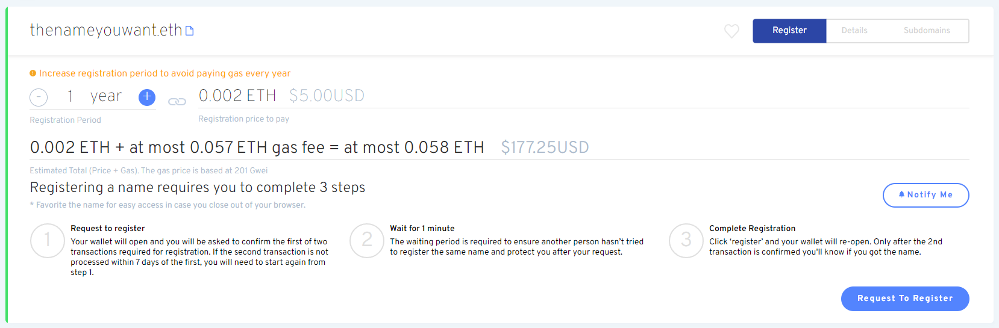

# Why are there 3 steps for registration?

There are three steps involved in registering an ENS name that is intended to solve the problem of front-running.

### Step 1: Request to Register

The commit in Step 1 hashes a secret key generated and stored in your browser's local storage and hashes it with your wallet address and ENS name so that you can later(within 7 days) request to register it without revealing it publicly.

**Note:** Completing Step 1 does not _reserve or hold_ the ENS name. The name will not be registered until Step 3 completes.

### Step 2: Wait for 1 minute

A 1 minute waiting period begins to prevent the front-running of the ENS name registration.

### Step 3: Register

The registration transaction is performed and the ENS name is registered; the ERC-721 NFT for the ENS name is minted and transferred into the registrant's wallet.

### In conclusion

If a miner wanted to try and front-run this process, they would have to send their own hashed secret, wait 1 minute and then register the name. Since they can't hold back your transaction for one minute, they will fail to do so, and the miner can't use the secret compared to the earlier hash.
