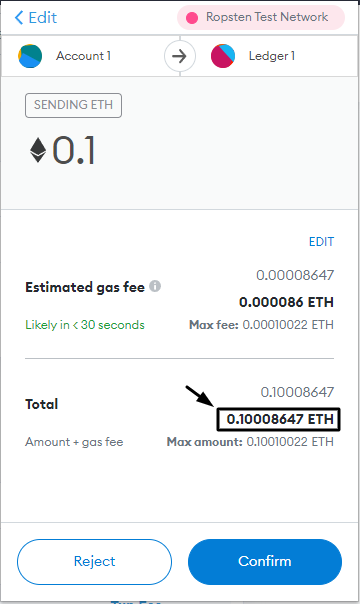

# What are gas fees?

Whenever you make a transaction on the Ethereum blockchain there are fees incurred for it, on Ethereum those fees are called _"Gas"._ The fees act as an incentive mechanism for miners to pick up your transaction and encode it onto the blockchain ledger and have three primary attributes:

### 1. Gas fee (or base cost)

If set too low the transaction will stall, and will drop once the mempool is full, but you won't be charged for gas. This fee is burned as of [EIP-1559](https://notes.ethereum.org/@vbuterin/eip-1559-faq).

### 2. Tip (or priority fee)

A tip or priority fee is paid to incentivize miners to include your transaction in a block as soon as possible.

### 3. Gas limit

The upper limit on how much gas is allowed to be used, if set too low the transaction will fail and you'll be charged for the gas used up until that point.\

### Always review transactions

Ethereum gas fees fluctuate constantly and in order to use Ethereum economically it's a good idea to always keep an eye on the current gas price using a [gas tracker](https://etherscan.io/gastracker) and to always review transfer costs before confirming them, in order to avoid incurring high charges due to sudden spikes in gas fees.

#### Know how to adjust gas costs

There are times when you may need to adjust gas fee settings manually, take time to learn how to do this in the wallet you use so as to avoid making (costly) mistakes later.\

#### Make sure the gas fee isn't excessive 

#### Make sure the total amount of the transaction is what you expect 

If the fees and the value of the transaction is what you expect it to be, then confirm the transaction.
