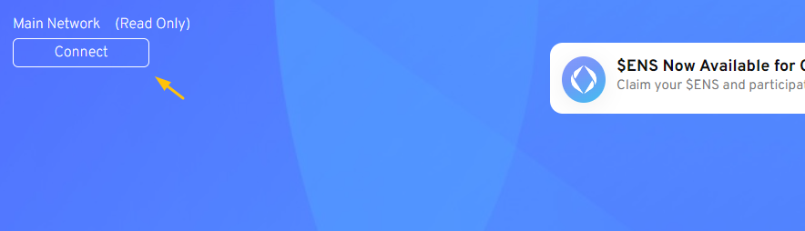
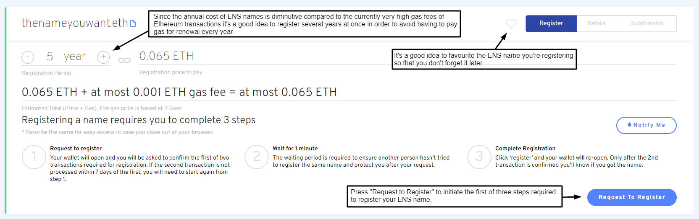
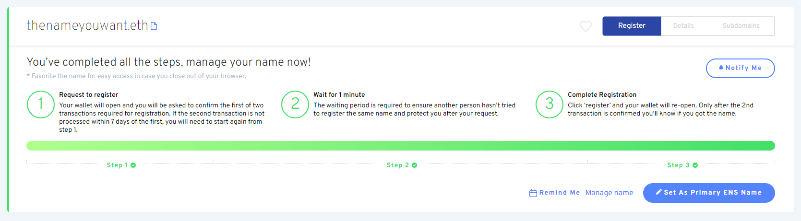

# تسجيل اسم

### الذهاب إلى مدير ENS

انتقل إلى تطبيق [ENS Manager](https://app.ens.domains) و قم بتوصيل محفظتك مع زر الاتصال. تأكد من أن محفظتك تظهر كـ _متصلة_ أو أن التسجيل لن يكون ناجحاً.

### قم بتوصيل محفظتك

اختر كيفية الاتصال مع محفظتك. في حالة عدم التأكد مما إذا كانت محفظتك تدعم WalletConnect أم لا، يتم توفير قائمة على موقع WalletConnect [هنا](https://walletconnect.com/registry/wallets).

### البحث عن اسم ENS الذي تريده

شريطة أن يكون الاسم الذي بحثت عنه متاحا، انقر عليه لمواصلة التسجيل.

### تسجيل اسم ENS الخاص بك

ويعد تسجيل اسم نظام التصنيف الوطني للغلاف الجوي عملية في ثلاث خطوات لمنع التيار الأمامي، بحيث لا يمكن لأحد سرقة اسم ENS الخاص بك من أسفلك بينما أنت في عملية تسجيله.

#### الخطوة 1: طلب التسجيل

النقر على طلب التسجيل يبدأ الخطوة 1 من عملية 3 خطوات. تتم معاملة 0ETH حيث يتم تجزئة اسمك بمفتاح سري بحيث لا يستطيع أي شخص آخر رؤية الاسم الذي تحاول تسجيله. وستترتب على هذه الخطوة رسوم للغاز، فضلا عن الخطوة الثالثة الأخيرة.

تم تخزين هذا المفتاح في وحدة التخزين المحلية للمتصفح، لذا تأكد من تجنب مسح البيانات المحلية للمتصفح الخاص بك قبل الانتهاء من الخطوات الثلاث جميعها، أو سوف تضطر إلى تكرار الخطوة 1 مرة أخرى.\

إنها فكرة جيدة أن:

* النظر في تسجيل اسم ENS الخاص بك لأكثر من سنة واحدة لتجنب دفع رسوم الغاز مقابل التجديد كل سنة.
* تفضّل اسم ENS الذي تقوم بالتسجيل في حالة نسيانه لاحقاً.

بمجرد أن تكون جاهزاً انقر فوق "طلب التسجيل".

تحقق من أن تكلفة المعاملة هي ما تتوقع أن تكون عليه وتأكيد المعاملة في محفظتك.

#### الخطوة 2: انتظر 1 دقيقة

بعد اكتمال عملية الخطوة 1 هناك فترة انتظار 1 دقيقة لمنع التشغيل الأمامي.

#### الخطوة 3: التسجيل

بعد الانتظار لمدة دقيقة واحدة والخطوة 2 قد انتهت من الوقت الفعلي _لتسجيل_ اسم ENS الخاص بك. لديك ما يصل إلى 7 أيام للقيام بذلك من وقت الانتهاء من معاملة الخطوة 1، ولكن لا يغيب عن البال أن اسم ENS الخاص بك ليس محجوزا لك حتى _قم بتسجيل_.

وقد يكون من المفيد التحقق المزدوج من أن تكاليف الغاز لا تزال منخفضة خلال هذه الفترة. بمجرد أن تكون جاهزاً للمتابعة انقر فوق زر السجل وتأكيد المعاملة في محفظتك.\

تهانينا! إذا مرت جميع المعاملات بنجاح، فيجب عليك الآن أن تكون المالك الفخور لاسم ENS الخاص بك!

 