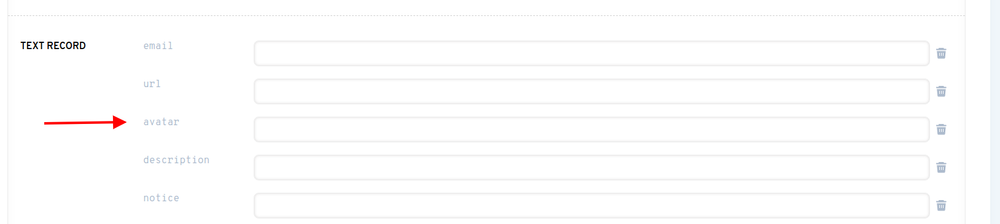

# إعداد الصورة الرمزية لملفك الشخصي

**تحذير**: الدعم في ادارة ENS الآن يدوي جدا! وستصدر قريباً إعادة تصميم لمدير نظام NS لجعل هذا الأمر أيسر بكثير. ولكن هذا دليل في الوقت الحالي.

### هل لديك اسم ENS؟

إذا لم يكن لديك بالفعل اسم ENS، يمكنك تسجيل اسم ENS أو استيراد اسم نطاق DNS الذي تملكه بالفعل في [تطبيق. ns.domains](https://app.ens.domains). يمكنك تعيين الصورة الرمزية NFT لأي نوع من اسم ENS.

### هل تم تعيين سجل اسم ENS الأساسي الخاص بك؟

الاسم الرئيسي هو سجل يحمل اسم ENS الذي تملكه والذي يمثل محفظتك.

إذا لم يكن لديك اسم رئيسي محدد، فيمكنك المتابعة <!-- **Primary Name Guide Link ** --> كدليل.

### هل أنت على استعداد لإنفاق ETH على رسوم الغاز؟

ربما أنت على علم بماهية رسوم الغاز على شبكة إيثيريوم الآن إن لم تكن كذلك، يمكنك<!-- \[read here\](/references/ethereum/what-are-gas-fees.md) -->، وبما أن هذه المعاملة ستكون **على السلسلة**، فهذا يعني أنك **سوف تضطر إلى إنفاق ETH**. إذا كنت مأخوذ بهذا الكمال! يمكنك متابعة الخطوات

### تعيين سجل الصورة الرمزية

اذهب إلى [app.ens.domains](https://app.ens.domains) وابحث عن اسم ENS الخاص بك للوصول إلى صفحة سجلاته. تأكد من الاتصال مع المحفظة التي هي مراقب اسم ENS. يجب أن ترى زر `ADD/EDIT RECORD`. انقر عليه، ثم امسح للأسفل حتى تجد سجل نص الصورة الرمزية.



يمكنك وضع رابط HTTPS أو تجزئة IPFS إلى ملف في هذا الحقل، ولكن إذا كنت ترغب في وضع **NFT الذي تملكه**، ثم يمكنك إدخاله **مع هذا التنسيق**:

```
eip155:1/[NFT standard]:[العقد عنوان المجموعة NFT]/[الرمز المميز أو الرقم الموجود في المجموعة]
```

يمكنك العثور على كل هذه المعلومات في قسم `التفاصيل` من NFT الخاص بك على OpenSea.


النقر على النص الأزرق عبر `عنوان العقد` سيأخذك إلى صفحة Etherssc، حيث يمكنك نسخ عنوان العقد كاملا.


في هذا المثال ، ستضعون كل هذه المعلومات مثل هذا:

```
eip155:1/erc721:0xb7F7F6C52F2e2fdb1963Eab30438024864c313F6/2430
```

**تحذير: معيار الرمز المميز لا يمكن أن يحتوي على وصلة، ويجب أن يكون كل أحرف صغيرة. على الرغم من أن OpenSea قد تظهر كـ "ERC-721"، أدخلها كـ "erc721".**

وكما ذكر في بداية المادة، سيكون ذلك أيسر بكثير في المستقبل. غير أنه يلزم الآن تحديد كل شيء وتصويبه يدويا، ومن ثم ينبغي إدراك الأخطاء الشائعة السابقة، فضلا عن الأخطاء الأخرى مثل:

* تعيين معيار الرمز المميز إلى "erc721"، على الرغم من أنه في الواقع "erc1155"
* استخدام cryptokitty كـ NFT، وهو **غير مدعوم حاليا**
* استخدام أي NFT آخر لا يستخدم أي من NFT القياسية بالكامل. إذا كنت غير متأكد من هذا، يمكنك دائماً [السؤال في الشقاق](https://chat.ens.domains).

انقر فوق `حفظ` بمجرد إدخال NFT المنسقة بشكل صحيح في حقل النص. سيتم مطالبتك بالموافقة على معاملة في محفظتك.. سيتم مطالبتك بالموافقة على معاملة في محفظتك. بمجرد أن تظهر هذه المعاملة أنه يتم تأكيدها على Etherscan، يتم تعيين صورتك الرمزية!

### جرب ذلك!

قم بتحديث الصفحة في تطبيق مدير ENS، ويجب أن ترى اسم ENS والصورة الرمزية على الجانب الأيسر. قد يستغرق الأمر بضع ثوان لكي تظهر الصورة الرمزية لـ NFT، لكننا نعمل على تقليل هذا في المستقبل.


بعد ذلك، انتقل إلى OpenSea وابحث عن اسمك. قم بتحديث البيانات الوصفية (انقر فوق زر السهم الدائري في أعلى اليمين)، انتظر بضع دقائق، ثم أعد تحميل الصفحة. يجب أن تكون الصورة الرمزية الخاصة بك الآن صورة الخلفية لصورة NFT لاسم ENS الخاص بك!


الآن اذهب إلى [app.uniswap.org](https://app.uniswap.org) و قم بتوصيل محفظتك. أعطاها بضع ثوانٍ، ويجب أن يظهر اسم NS والصورة الرمزية الخاصة بك!


انقر فوق اسمك وسوف تراه مرة أخرى.


أخيرا، انتقل إلى [app.1inch.io](https://app.1inch.io) و قم بتوصيل محفظتك. كما هو الحال مع Uniswap، سوف تكون قادراً على رؤيته أولاً في أعلى اليمين.


وأيضا، ستتمكن من رؤيته إذا قمت بالنقر على اسم ENS الخاص بك.


هذا كل شيء! استمتع بالصورة الرمزية لـ NFT المعينة حديثاً!
