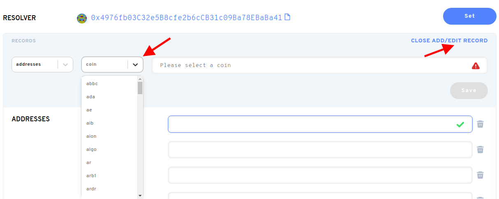

# كيف يمكنني استخدام اسم NS بعد شرائه في سوق ثانوية؟

بعد شراء اسم ENS الخاص بك في سوق ثانوية مثل OpenSea أو Rarible، يجب عليك التوجه إلى [ENS App](https://app.ens.domains). بمجرد توصيل محفظتك هناك، يمكنك تحديث السجلات لاسم ENS الخاص بك. يمكنك ملاحظة أن المسجل فقط قد تغير إلى عنوان محفظتك. بالضغط على "المجموعة"، سوف تقوم بتحديث سجل المراقب. تحديث سجلات اسم ENS سوف يقوم بتحديث حالة البلوكشين ، لذلك سوف يتكبد الغاز.

بعد تعيين المراقب المالي، يمكنك تحديث سجل عنوان ETH. ستصل أي عملة مشفرة (ERC20) أو NFTs(ERC721) مرسلة إلى اسم ENS الخاص بك إلى عنوان إيثيريوم المحفوظ هناك.

**هام:** دون تحديث هذه السجلات بعد الشراء في سوق ثانوية، معاملات العملات الرقمية المرسلة إلى الخاص بك. الاسم الثاني لن يصل في محفظتك (محفظاتك) بشكل افتراضي.

اسم ENS الخاص بك يمكنه تخزين عناوين الدفع لأكثر من إيثيريوم فقط. العملات التي يمكنك إضافتها، تشمل BTC، LTC، DOGE، و _العديد من_ أكثر.

