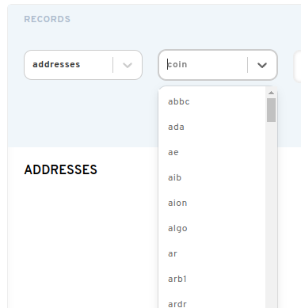

# Añadir otras direcciones de billetera a su nombre ENS.

Establecer una dirección que no sea Ethereum a su nombre permite a dApps que soporten ENS usar su Nombre de Ethereum para conectarse a otras direcciones de criptomonedas. Puede configurar direcciones no ETH en el administrador de dominio en [https://app.ens.domains](https://app.ens.domains/).

Recomendamos establecer varias direcciones a la vez para ahorrar en tarifas de gas. Añadir o eliminar criptomonedas implicará una solicitud de firma de cuota de gas.

### ¿Cómo puedo añadir otras billeteras?

En el Administrador de ENS, puede agregar una dirección de criptomoneda copiando y pegando su dirección de criptomoneda en el campo de dirección correspondiente.

Si su tipo de moneda no aparece en los campos preexistentes, encuentre el menú desplegable de monedas y seleccione su moneda. Haga clic en `ADD /EDIT RECORD`.

Cuando haya introducido toda la criptomoneda deseada, o han hecho cambios en sus otros registros, desplácese hacia abajo en la parte inferior de la página del administrador.

**Importante:** Para realizar estos cambios de forma permanente, debe seleccionar el botón "Confirm". Esto cambiará los datos de la cadena e incurrirá en una tasa de gas.

