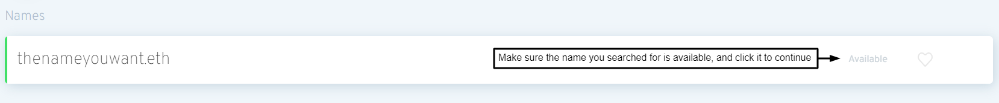

# Registrando un nombre

### Ir a ENS Manager

Vaya a la [aplicación ENS Manager](https://app.ens.domains) y conecte su cartera con el botón conectar. Asegúrese de que su cartera se muestra como _conectado_ o el registro probablemente no será exitoso.

### Conecte su cartera

Elige cómo conectarte con tu cartera. En caso de que no esté seguro de si su cartera soporta WalletConnect o no, se proporciona una lista en el sitio web de WalletConnect [aquí](https://walletconnect.com/registry/wallets).

### Busca el nombre de ENS que quieres

Proporcionado que el nombre que buscó está disponible, haga clic en él para continuar con el registro.

### Registrando tu nombre de ENS

Registrar un nombre de ENS es un proceso en tres pasos para prevenir el inicio del proceso, para que nadie pueda robar su nombre de ENS de debajo de usted mientras está en proceso de registrarlo.

#### Paso 1: Solicitud de registro

Al hacer clic en Solicitud de Registro inicia el paso 1 del proceso de 3 pasos. Una transacción 0ETH se realiza donde su nombre se almacena con una clave secreta para que nadie más pueda ver qué nombre intenta registrarse. Este paso incurrirá en tasas de gas, así como en el último Paso 3.

Esta clave se almacena en el almacenamiento local del navegador, así que asegúrese de evitar borrar los datos locales de su navegador antes de completar los tres pasos, o se verá obligado a repetir el paso 1 de nuevo.\

Es buena idea para:

* Considere registrar su nombre de ENS por más de 1 año con el fin de evitar tener que pagar tasas de gas por renovaciones cada año.
* Favorite the ESP name you register in case you forget it later.

Una vez que esté listo haga clic en "Solicitar registro".

Compruebe que el costo de la transacción es lo que usted espera que sea y confirme la transacción en su cartera.

#### Paso 2: Espere 1 minuto

Después de completar la transacción del paso 1, hay un periodo de espera de 1 minuto para evitar el inicio del proceso.

#### Paso 3: Registrarse

After you waited 1 minute and step 2 has completed it's time to actually _Register_ your ENS name. Tienes hasta 7 días para hacer esto desde el momento en que terminaste tu transacción de Paso 1, pero ten en cuenta que tu nombre de ENS no está reservado para ti hasta que _lo registre_.

Podría ser una buena idea comprobar que los costes del gas siguen siendo bajos durante este tiempo. Una vez que esté listo para continuar haga clic en el botón Registro y confirme la transacción en su cartera.\

¡Felicidades! If all transactions went through successfully you should now be the proud owner of your own ENS name!

 