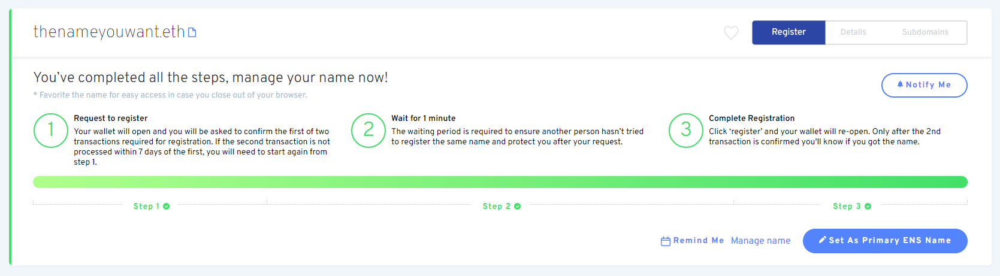

# Registrando un Nombre

### Ir al gestor del ENS

Vaya a la [aplicación ENS Manager](https://app.ens.domains) y conecte su billetera. Asegúrese de que su billetera se muestra como _conectado_ o el registro probablemente no será exitoso.

### Conecte su billetera

Elige cómo conectarse con su billetera. En caso de que no esté seguro de si su cartera soporta WalletConnect o no, se proporciona una lista en el sitio web de WalletConnect [aquí](https://walletconnect.com/registry/wallets).

### Busca el nombre ENS que quieres

Proporcionado que el nombre que buscó está disponible, haga clic en él para continuar con el registro.

### Registrando su nombre ENS

Registrando un nombre ENS es un proceso partido en tres pasos para prevenir el robo de su nombre ENS mediante el uso de información privilegiada.

#### Paso 1: Solicitud de registro

Al hacer clic en Solicitud de Registro se inicia el paso primero del proceso de 3 pasos. Una transacción 0ETH se realiza donde su nombre se almacena con una clave secreta para que nadie más pueda ver qué nombre intenta registrarse. Este paso incurrirá en tasas de gas, así como en el último paso

Esta clave se almacena en el almacenamiento local del navegador, así que asegúrese de evitar borrar los datos locales de su navegador antes de completar los tres pasos, o se verá obligado a repetir el paso 1 de nuevo.

Es buena idea para:

* Considere registrar su nombre ENS por más de 1 año con el fin de evitar tener que pagar tasas de gas por renovaciones cada año.
* Guarda el nombre ENS que usted quiere registrar en caso que se olvides.

Una vez que esté listo, haga clic en "Solicitar registro".

Compruebe que el costo de la transacción es lo que usted espera que sea y confirme la transacción en su billetera.

#### Paso 2: Espere un minuto

Después de completar la transacción, hay un periodo de espera de un minuto para evitar el inicio del información privilegiada.

#### Paso 3: Registrar

Después de esperar un minuto, se actualiza el _registro_ de su nombre ENS. Tienes hasta 7 días para cumplir este paso desde el momento en que inicio la primer transacción, pero ten en cuenta que tu nombre ENS no está reservado para ti hasta que _lo registre_.

Podría ser una buena idea comprobar que los costes del gas siguen siendo bajos durante este tiempo. Una vez que esté listo para continuar haga clic en el botón Registro y confirme la transacción en su billetera.

¡Felicitaciones! Si todas las transacciones fueron exitosos, debe ahora ser el propietario de su nombre ENS.

 