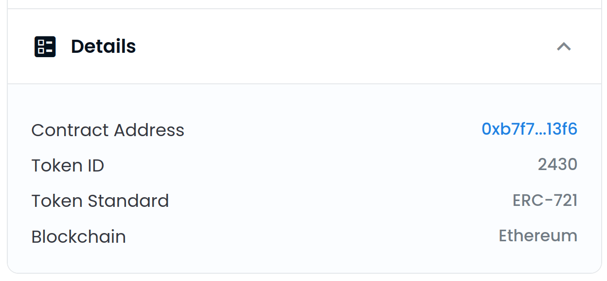
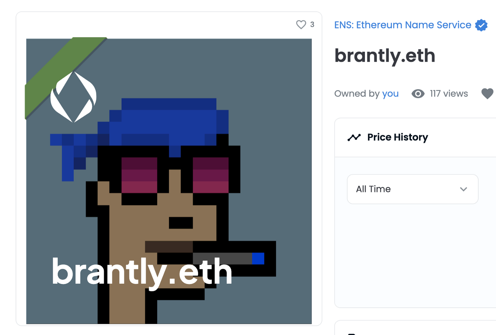
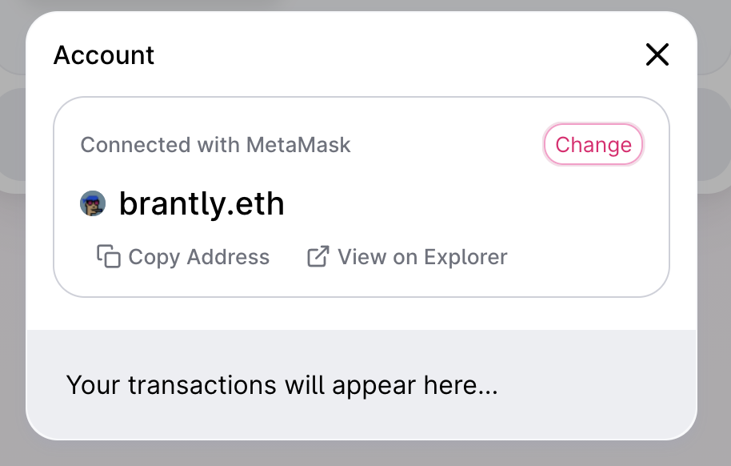

# Configurando tu Avatar de Perfil

**ADVERTENCIA**: ¡Soporte en el Gestor de ENS ahora mismo es muy manual! A redesign of the ENS manager will be released soon to make this much more manageable. Por ahora, sin embargo, aquí hay una guía.

### ¿Tienes un nombre de ENS?

Si aún no tienes un nombre de ENS, puede registrar un nombre ENS o importar un nombre de dominio DNS que ya posee en [app. ns.domains](https://app.ens.domains). You can set a NFT avatar for either kind of ES name.

### Is your Primary ENS Name record set?

A primary name is a record of which ES name you own that represents your wallet.

Si no tienes un nombre primario, puedes seguir <!-- **Primary Name Guide Link ** --> como guía.

### ¿Está dispuesto a gastar ETH en tasas de gas?

Probablemente ya sabes cuáles son las tarifas de gas en la red Ethereum si no, puedes<!-- \[read here\](/references/ethereum/what-are-gas-fees.md) -->, y dado que esta transacción será **en cadena**, significa que **tendrás que gastar ETH**. Si estás de acuerdo con eso, ¡perfecto! Puedes continuar siguiendo los pasos

### Configurando el registro de Avatar

Go to [app.ens.domains](https://app.ens.domains) and search for your ES name to get to its records page. Asegúrese de que se conecta con la cartera que es el controlador del nombre de ENS. Deberías ver un botón `AÑADIR /EDITAR` Haga clic en él y desplácese hacia abajo hasta que encuentre el Registro de Texto de Avatar.


Puede poner un enlace HTTPS o un hash IPFS a un archivo en este campo, pero si quieres poner un **NFT que posees**, entonces puedes introducirlo **con este formato**:

```
eip155:1/[NFT standard]:[la dirección del contrato para la colección NFT]/[token ID o el número en la colección]
```

Puede encontrar toda esta información en la sección `Detalles` de su NFT en OpenSea.



Al hacer clic en el texto azul a través de `Dirección del Contrato` se le llevará a la página de Etherscan , donde puede copiar la dirección completa del contrato.


En este ejemplo, pondrías toda esta información como esta:

```
eip155:1/erc721:0xb7F7F6C52F2e2fdb1963Eab30438024864c313F6/2430
```

**Advertencia: El estándar de token no puede contener un guión, y debe estar en minúsculas. Así que aunque OpenSea pueda mostrarlo como "ERC-721", introdúzcalo como "erc721".**

Como se mencionó al principio del artículo, esto será mucho más fácil en el futuro. Por ahora, sin embargo, todo tiene que ser establecido y corregido manualmente, así que tenga en cuenta los errores comunes anteriores, así como otros como:

* Establecer el estándar de token a "erc721", aunque en realidad es "erc1155"
* Usando un criptokitty como NFT, el cual **no está actualmente soportado**
* Utilizar cualquier otro NFT que no use ni el estándar NFT por completo. Si no estás seguro de esto, siempre puedes [preguntar en Discord](https://chat.ens.domains).

Haga clic en `Guardar` una vez que el NFT formateado correctamente haya sido introducido en el campo de texto. Se le pedirá que apruebe una transacción en su cartera. Se le pedirá que apruebe una transacción en su cartera. Una vez que esa transacción muestre que se confirma en Etherscan, ¡tu avatar está establecido!

### ¡Pruébalo!

Actualiza la página en la aplicación Administrador de ENS, y deberías ver tu nombre y avatar de ENS en el lado izquierdo. Puede tardar unos segundos en aparecer tu avatar NFT, pero estamos trabajando en reducir esto en el futuro.


A continuación, diríjase a OpenSea y busque su nombre. Actualice los metadatos (haga clic en el botón circular de la flecha de la parte superior derecha), espere unos minutos y luego vuelva a cargar la página. Your avatar should now be the background image for the NFT image of your ENS name!



Ahora visita [app.uniswap.org](https://app.uniswap.org) y conecta tu monedero. Dale unos segundos, y tu nombre y avatar de ENS debería aparecer!


Haz clic en tu nombre y lo verás de nuevo.


Por último, ve a [app.1inch.io](https://app.1inch.io) y conecta tu cartera. Del mismo modo, a Uniswap, podrás verlo primero en la parte superior derecha.



Also, you'll be able to see it if you click your ES name.


¡Eso es todo! ¡Diviértete con tu nuevo avatar NFT!
