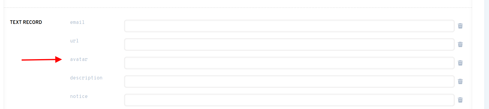
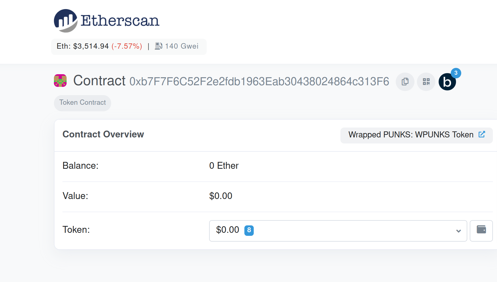
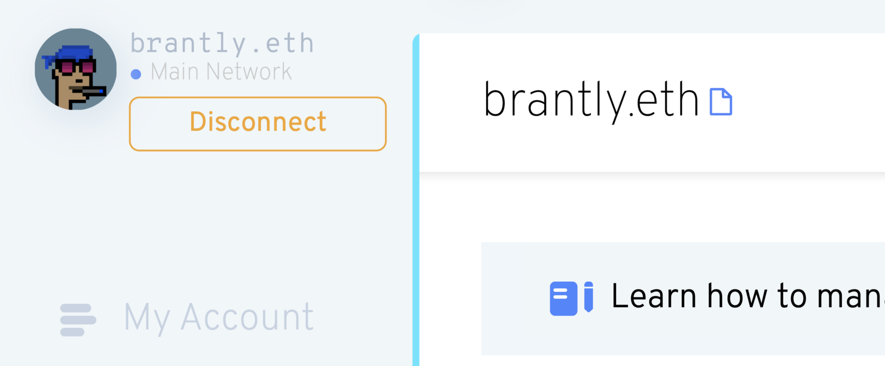
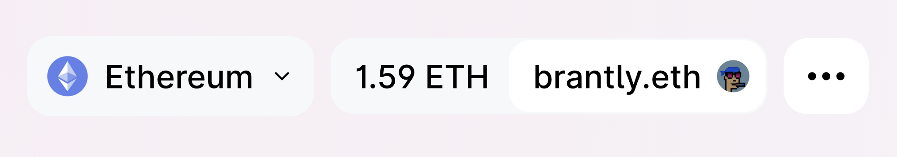

# Configurando tu Avatar de Perfil

**ADVERTENCIA**: ¡Soporte en el Gestor de ENS ahora mismo es muy manual! A redesign of the ENS manager will be released soon to make this much more manageable. Por ahora, sin embargo, aquí hay una guía.

### ¿Tienes un nombre ENS?

Si aún no tienes un nombre de ENS, puede registrar un nombre ENS o importar un nombre de dominio DNS que ya posee en [app.ens.domains](https://app.ens.domains). Puedes establacer un Avatar de NFT para cualquier nombre ENS.

### ¿Ha establecido su nombre Primario ENS?

Un nombre primario es un registro que indica cual nombre ENS representa su dirección de billetera.

If you don’t have a primary name set, you can follow <!-- **Primary Name Guide Link ** --> as a guide.

### ¿Está dispuesto a gastar ETH en tasas de gas?

You're probably aware of what gas fees on the Ethereum network are by now if not, you can<!-- \[read here\](/references/ethereum/what-are-gas-fees.md) -->, and since this transaction will be **on-chain**, it means that you **will have to spend ETH**. If you're ok with that, perfect! You can continue following the steps

### Configurando el registro de Avatar

Ir a [app.ens.domains](https://app.ens.domains) y busca su nombre ENS para acceder la pagina de registros. Asegúrese conectarse con la billetera que es el controlador del nombre de ENS. Deberías ver un botón `ADD /EDIT RECORD` butón. Haga clic en él y desplácese hacia abajo hasta que encuentre el Registro de Texto de Avatar.



Puede poner un enlace HTTPS o un hash IPFS a un archivo en este campo, pero si quieres poner un **NFT que posees**, entonces puedes introducirlo **con este formato**:

```
eip155:1/[NFT standard]:[contract address for NFT collection]/[token ID or the number it is in the collection]
```

Puede encontrar toda esta información en la sección `Detalles` de su NFT en OpenSea.


Al hacer clic en el texto azul a través de `Contract Address` se le llevará a la página de Etherscan, donde puede copiar la dirección completa del contrato.



In this example, you would put all this information in the following manner:

```
eip155:1/erc721:0xb7F7F6C52F2e2fdb1963Eab30438024864c313F6/2430
```

**Advertencia: El estándar de token no puede contener un guión, y debe estar en minúsculas. Así que aunque OpenSea pueda mostrarlo como "ERC-721", introdúzcalo como "erc721".**

Como se mencionó al principio del artículo, esto será mucho más fácil en el futuro. Por ahora, sin embargo, todo tiene que ser establecido y corregido manualmente, así que tenga en cuenta los errores comunes anteriores, así como otros como:

* Establecer el estándar de token a "erc721", aunque en realidad es "erc1155"
* Usando un criptokitty como NFT, el cual **no es actualmente compatible**
* Usando cualquier otro NFT que no use ni el estándar NFT por completo. Si no estás seguro de esto, siempre puedes [preguntar en Discord](https://chat.ens.domains).

Haga clic en `Save` una vez que el NFT formateado correctamente haya sido introducido en el campo de texto. Se le pedirá que apruebe una transacción en su billetera. Una vez que esa transacción muestre que se confirma en Etherscan, ¡tu avatar está establecido!

### ¡Pruébalo!

Actualiza la página en la aplicación Administrador de ENS, y deberías ver tu nombre y avatar de ENS en el lado izquierdo. Puede tardar unos segundos en aparecer tu avatar NFT, pero estamos trabajando en reducir esto en el futuro.



A continuación, diríjase a OpenSea y busque su nombre. Actualice los metadatos (haga clic en el botón circular de la flecha de la parte superior derecha), espere unos minutos y luego vuelva a cargar la página. ¡Tu avatar debería ser ahora la imagen de fondo de la imagen NFT de tu nombre ENS!


Ahora visita [app.uniswap.org](https://app.uniswap.org) y conecta tu monedero. Dale unos segundos, y tu nombre y avatar de ENS debería aparecer.



Haga clic en su nombre y lo verá de nuevo.


Por último, ve a [app.1inch.io](https://app.1inch.io) y conecta su billetera. Del mismo modo, a Uniswap, podrás verlo primero en la parte superior derecha.


También, podrás verlo si haces clic en su nombre ENS.


¡Eso es todo! ¡Diviértete con su nuevo avatar NFT!
