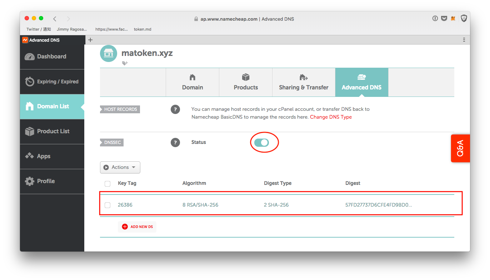

# Importar un dominio DNS a ENS

### Introducción

DNSSEC (The Domain Name System Security Extensions) establishes a chain of trust from the root key which signed by ICANN (.) and down through each key. Dado que DNSSEC está habilitado y una dirección ETH es puesta en el subdominio del dominio que usted posee (por ejemplo: `_ens.yourdomain. ld`), El gestor ENS permite a cualquiere individuo enviar el hash de la cadena a el `DNSSEC Oracle` contrato inteligente.

### Paso 1

Al empezar utilizar el gestor ENS, se muestra así:

If your DNS provider already supports DNSSEC-signed domains, all you do is to enable the option on the DNS manager. If they don’t, you’ll need to migrate to someone who does.

Recomendamos [EasyDNS](https://www.easydns.com) o [Google Cloud DNS](https://cloudplatform.googleblog.com/2017/11/DNSSEC-now-available-in-Cloud-DNS.html). La guía de configuración de EasyDNS para DNSSEC es [aquí](https://fusion.easydns.com/Knowledgebase/Article/View/18/7/dnssec), mientras que la de Google está [aquí](https://cloud.google.com/dns/dnssec-config). Cualquiera que sea el proveedor que necesite, asegúrese de seleccionar firmas RSA y SHA256 hashing para no incurrir en las altas tasas de gas de intentar vincular su nombre de ENS con claves ECDSA.

#### Una lista de proveedores de alojamiento populares y qué tipos de claves soportan para su configuración DNSSEC:

* **Integración nativa ENS**
  * [easyDNS](https://easydns.com/)
* **RSA/SHA-256 / ECDSA**
  * [DNS de Google Cloud](https://cloud.google.com/dns)
  * [Bluehost](https://www.bluehost.com/)
  * [Hostinger](https://hostinger.com)
  * [Hostgator](https://hostgator.com)
* **Sólo ECDSA**
  * [GoDaddy](https://www.godaddy.com)
* **Sin soporte DNSSEC**
  * [Wordpress](https://www.wordpress.com) _cuando se utiliza como el proveedor DNS._

### Paso 2: Agregar un registro TXT

El registrador de DNS en ENS busca un registro TXT con un nombre y formato específicos para verificar a qué dirección de Ethereum se le debe dar la propiedad del dominio. Para reclamar la propiedad de [mydomain.xyz](https://mydomain.xyz), crea un registro TXT en tu zona DNS, \_[ens.mydomain. yz](https://ens.mydomain.xyz), con datos de texto de la forma a=0x1234... donde 0x1234... es la dirección que usted deseas dar control del registro ENS.

### Paso 3: Registrando el nombre ENS

Al llegar a este paso, puedes terminar el proceso desde el gestor ENS. Simplemente haga clic en "Register" y envíe la transacción.

### Paso 4: Ir al administrador

