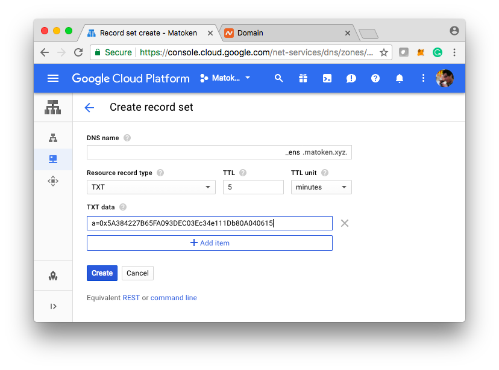
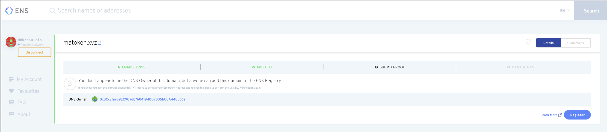

# Importar un dominio DNS en ES

### Introducción

DNSSEC (The Domain Name System Security Extensions) establece una cadena de confianza a partir de la clave raíz firmada por ICANN (. y abajo a través de cada clave. Dado que DNSSEC está habilitado y una dirección ETH es puesta en el subdominio del dominio que usted posee (por ejemplo: `_ens.yourdomain. ld`), ENS manager permite a cualquiera enviar el hash de la cadena a `DNSSEC Oracle` contrato inteligente

### Paso 1

When you first land on ES manager, you will see something like below.

Si su proveedor DNS ya soporta dominios firmados por DNSEC, todo lo que usted hace es habilitar la opción en el administrador DNS. Si no lo hacen, tendrás que migrar a alguien que lo haga.

Recomendamos [EasyDNS](https://www.easydns.com) o [Google Cloud DNS](https://cloudplatform.googleblog.com/2017/11/DNSSEC-now-available-in-Cloud-DNS.html). La guía de configuración de EasyDNS para DNSSEC es [aquí](https://fusion.easydns.com/Knowledgebase/Article/View/18/7/dnssec), mientras que la de Google está [aquí](https://cloud.google.com/dns/dnssec-config). Cualquiera que sea el proveedor que necesite. Asegúrese de seleccionar firmas RSA y hashing SHA256 para no incurrir en las altas tasas de gas de intentar vincular su nombre de ENS con claves ECDSA.

#### Una lista de proveedores de hosting populares y qué tipos de claves soportan para su configuración DNSSEC

* **Integración nativa ENS**
  * [easyDNS](https://easydns.com/)
* **RSA/SHA-256 / ECDSA**
  * [DNS de Google Cloud](https://cloud.google.com/dns)
  * [Bluehost](https://www.bluehost.com/)
  * [Hostinger](https://hostinger.com)
  * [Hostgator](https://hostgator.com)
* **Sólo ECDSA**
  * [GoDaddy](https://www.godaddy.com)
* **No hay soporte DNSSEC**
  * [Wordpress](https://www.wordpress.com) _cuando se utiliza como el proveedor DNS._

### Paso 2: Agregar un registro TXT

The DNS Registrar on ENS looks for a TXT record with a specific name and format in order to verify what Ethereum address should be given ownership of the domain. Para reclamar la propiedad de [mydomain.xyz](https://mydomain.xyz), crea un registro TXT en tu zona DNS, \_[ens.mydomain. yz](https://ens.mydomain.xyz), con datos de texto de la forma a=0x1234... donde 0x1234... is the Ethereum address you want to give control of the ES record to.

### Paso 3: Registrando el nombre en ES

Once you get to this stage, you can complete the rest from ES manager. Simplemente presione "Registro" y envíe la transacción.

### Paso 4: Ir al administrador

