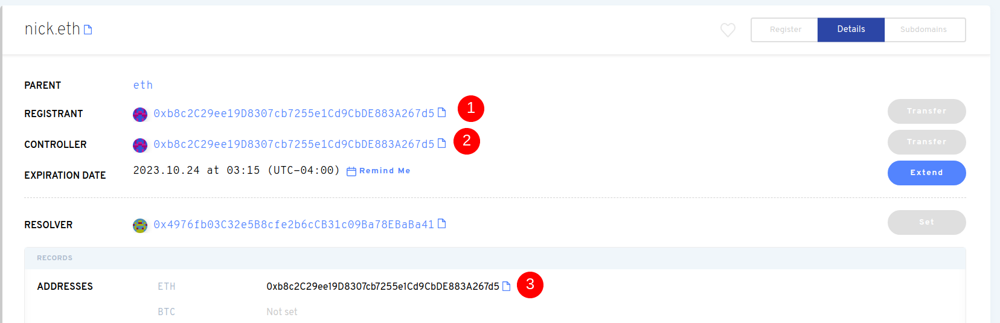

# Transferir la Propiedad de Un Nombre ENS

Para transferir la propiedad de un nombre ENS a otra billetera, conéctate a la aplicación ENS. La billetera que figura como Registrante es la **propietaria** del nombre ENS. En la captura de pantalla de abajo, (1) indica al Registrante.

Mientras esté conectado a la aplicación ENS con la billetera del Registrante, podrá hacer clic en "Transfer", e introducir una dirección de billetera a la que transferir la propiedad del nombre ENS.

Sin embargo, el Controlador es la billetera que puede actualizar otros registros como la Dirección ETH (ver #3 en la imagen anterior). Transferir el Registro a una nueva billetera _no actualiza automáticamente_ la dirección del Controlador (ver #2 en la captura de pantalla), y no cambia la dirección de pago ETH. Estas son transacciones separadas que costarán gas actualizar.

Algunos usuarios pueden querer transferir completamente un nombre a otra billetera y tener los mismos registros por defecto configurados como si la nueva billetera registrara el nombre. Para ello, la billetera de Controlador debería actualizar primero la dirección ETH (ver #3) a la nueva dirección de la billetera. Una vez que se haya cambiado, la billetera del Registrante tendrá que actualizar el registro del Controlador a la misma dirección de la nueva billetera. Por último, el Registrante debería transferir la propiedad a la nueva billetera. De esta manera, el nombre se transfiere totalmente a una nueva billetera, y que el destinatario no tiene que hacer configuración adicional además de establecer su nombre primario. El orden de este proceso sí importa. Si el Registrante, por ejemplo, se transfiere a la nueva billetera primero, sólo la nueva billetera puede actualizar el Controlador.

**Importante:** Sin actualizar el registro del Controlador, los tokens enviados a _othername.eth_ seguirán llegando a la billetera original. Tanto el registro como el controlador deben ser cambiados!

<!-- ### Further Reading:

* [Setting Your Primary Name](setting-your-primary-name.md) 
-->
