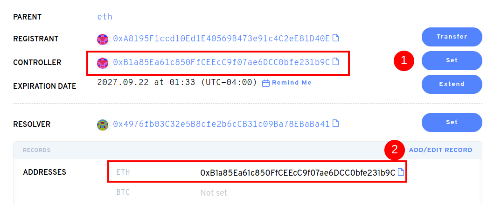

# ¿Cómo utilizo un nombre ENS después de comprarlo en un mercado secundario?

Después de comprar su nombre ENS en un mercado secundario como OpenSea o Rarible, deberías ir a la [aplicación ENS](https://app.ens.domains). Una vez que conecte su cartera allí, puede actualizar los registros de su nombre ENS. Puede notar que sólo el Registro ha cambiado a su dirección de billetera. Al hacer clic en “Configurar”, actualizará el registro del Controlador. Actualizar registros de nombres ENS actualizará el estado de la cadena de bloques, así que esto incurrirá en gas.

Después de configurar el Controller, puede actualizar el registro de Dirección ETH. Cualquier criptomoneda (ERC20) o NFTs(ERC721) enviada a su nombre ENS llegará a la dirección de Ethereum guardada allí.

**Importante:** Sin actualizar estos registros después de la compra en un mercado secundario, las transacciones de criptomonedas que se envían a su Ens no llegará por defecto a su(s) billetera(s).

Su nombre ENS puede almacenar direcciones de pago afuera de Ethereum. Las monedas que puedes añadir, incluyen BTC, LTC, DOGE y _muchas_ más.

