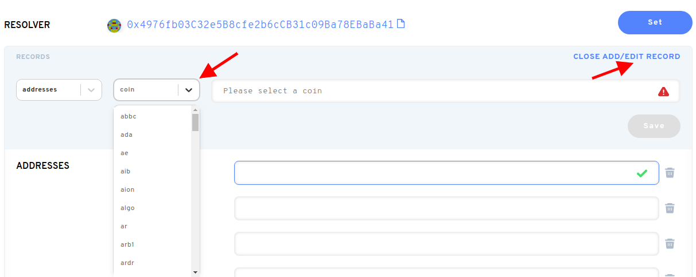

# ¿Cómo utilizo un nombre de ENS después de comprarlo en un mercado secundario?

Después de comprar tu nombre de ENS en un mercado secundario como OpenSea o Rarible, deberías ir a la [aplicación ENS](https://app.ens.domains). Una vez que conecte su cartera allí, puede actualizar los registros de su nombre de ENS. Puede notar que sólo el Registro ha cambiado a su dirección de cartera. Al hacer clic en “Configurar”, actualizará el registro del Controlador. Actualizar registros de nombres de ENS actualizará el estado de la cadena de bloques, así que esto incurrirá en gas.

Después de configurar el Controller, puede actualizar el registro de Dirección ETH. Cualquier criptomoneda (ERC20) o NFTs(ERC721) enviada a su nombre ENS llegará a la dirección de Ethereum guardada allí.

**Importante:** Sin actualizar estos registros después de la compra en un mercado secundario, las transacciones de criptomonedas se enviaron a su . El nombre de la figura no llegará por defecto a su(s) cartera(s).

Your ENS name can store payment addresses for more than just Ethereum. Las monedas que puedes añadir, incluyen BTC, LTC, DOGE y _muchas_ más.

