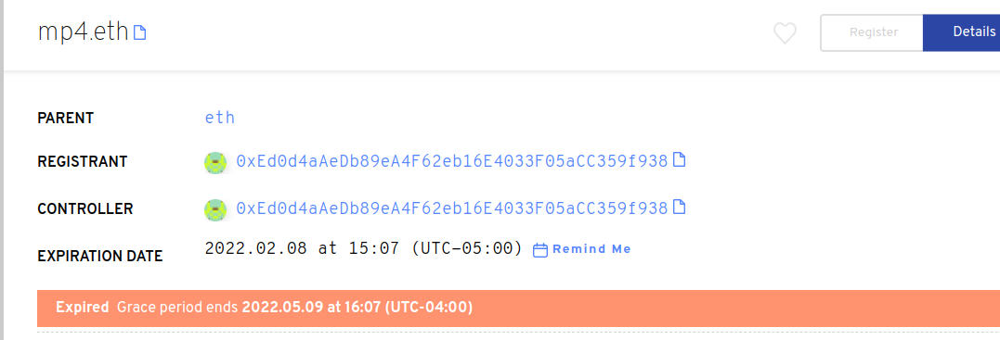

# ¿Qué es un período de gracia?

El **período de gracia** es una plaza de 90 días que se da tras la caducidad de un nombre ENS. Durante este tiempo el nombre no puede ser transferido a un nuevo Registro (propietario) y los registros no pueden ser actualizados. Primero hay que renovar el nombre del ENS para que salga del periodo de gracia y tenga una fecha de caducidad en el futuro.

Si el nombre ENS no se renueva antes de que finalice el periodo de gracia, el nombre entrará en una subasta holandesa premium durante 28 días. Al final de 28 días el nombre de ENS ya no tendrá una prima adjunta y puede ser registrado a la tarifa anual estándar. La subasta premium comienza actualmente en $100,000,000 USD y disminuye con una decadencia no lineal durante 28 días. Si el nombre se compra durante el período de la prima, el comprador pagará el precio de subasta de la prima y la tarifa anual estándar.

### Lecturas adicionales:<!-- * \[What is a premium auction?\](what-is-a-premium-auction.md) -->
