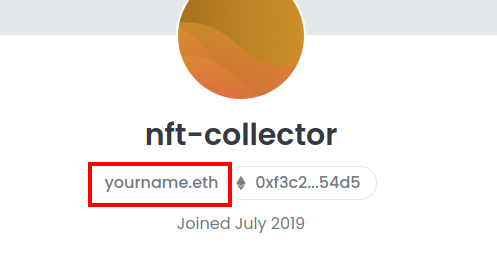

# ¿Qué es un nombre primario?

### Nombre ENS Primario

El nombre principal ENS es el registro inverso que resuelve una dirección de billetera a un nombre ENS.&#x20;

Configurando su registro principal de nombre ENS permitirá a dApps encontrar su nombre ENS cuando se conecte con su billetera de Ethereum. Por ejemplo, una billetera Ethereum con un nombre primario de ENS mostrará primaryname_.eth_ cuando inicie sesión en Uniswap. En OpenSea, su perfil mostrará su nombre ENS principal en su página de perfil. Esto se debe a que OpenSea se integra con ENS y lee el registro inverso para encontrar el nombre ENS.

Aunque es común, el nombre principal no necesita ser la misma billetera que el propietario del nombre ENS o Registrante. Mientras la billetera de Ethereum esté configurado como el registro de direcciones ETH, esa billetera puede seleccionar el nombre ENS como su selección de nombre principal.

Para seleccionar un nombre ENS primario, dirígete a la [aplicación ENS](https://app.ens.domains) e inicia sesión con su billetera. Una vez conectado, haga clic en "My Account". A continuación, podrá elegir un nombre ENS principal para asociarlo a su billetera. Sólo los nombres ENS con su billetera en su registro de dirección ETH estarán disponibles en la lista desplegable como nombre principal.

**Nota:** Una dirección de billetera solo puede tener un nombre primario.

### Lecturas adicionales:

