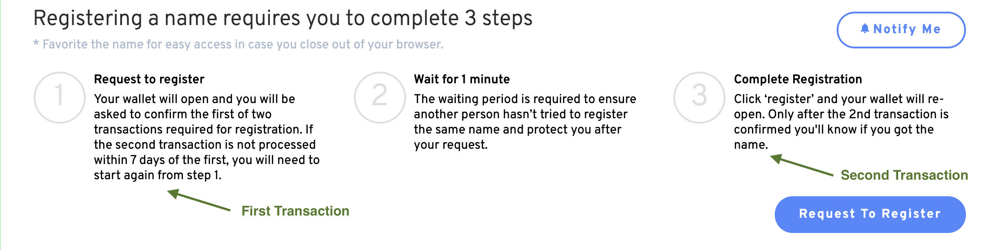

# ¿Por qué no aparece mi nombre ENS en mi billetera?

Por favor, verifique que su registración fue exitoso, por favor verifique su historial de transacciones en [Etherscan.io](https://www.etherscan.io). Los registros exitosos verán dos transacciones: `Commit` **y** `Registro con Configuración`. Estas transacciones representan el Paso 1 y el Paso 3 del proceso de registrar ENS.

## Solución de problemas

1.  **Compruebe su dirección en** [**Etherscan.io**](https://www.etherscan.io)**.**

    Consulta la dirección de la billetera que se utilizó para registrar un nombre ENS.<!-- _If your address does not show any registration transactions proceed to_ \[#wrong-address\](why-isnt-my-ens-name-in-my-wallet.md#wrong-address "mention")__ -->2.  **Asegúrese de que el paso 1 del registro se haya completado.**

    Busca una transacción con el método de `Commit`. Esta transacción debería estar presente y haber interactuado con el [Controlador Registrador de ENS.](https://etherscan.io/address/0x283af0b28c62c092c9727f1ee09c02ca627eb7f5)__

    _Si la transacción `Commit` no está presente, proceda a_<!--\[#registration-incomplete.\](why-isnt-my-ens-name-in-my-wallet.md#registration-incomplete. "mention")-->__

    _Si no interactuó con el Registrador de ENS, proceda a_<!-- \[#fraudulent-activity\](why-isnt-my-ens-name-in-my-wallet.md#fraudulent-activity "mention")-->__

3.  **Asegúrese de que el paso 3 del registro se haya completado.**

    Busca una transacción con el método de `Commit`. Esta transacción debería estar presente y haber interactuado con el [Controlador Registrador de ENS.](https://etherscan.io/address/0x283af0b28c62c092c9727f1ee09c02ca627eb7f5)

    _Si la transacción `Commit` no está presente, proceda a_<!--\[#registration-incomplete.\](why-isnt-my-ens-name-in-my-wallet.md#registration-incomplete. "mention")-->__

    _Si no interactuó con el Registrador de ENS, proceda a_<!-- \[#fraudulent-activity\](why-isnt-my-ens-name-in-my-wallet.md#fraudulent-activity "mention")-->__

## Errores de registro

### Dirección incorrecta

Usted registró erróneamente su nombre en otra billetera que usted posee.

**Acción correcta:** _Conecta la billetera correcta a la aplicación ENS. Si su nombre ENS fue registrado por error en otra dirección de su propiedad, puede transferir el nombre cambiando el Registrante. Si no necesita migrarlo a una nueva billetera, también puedes apuntar tu ENS a cualquier dirección de cartera configurando el Controlador._

__

### Registro **incompleto**.

Uno de los pasos se perdió o no se completó. Debe completar todos los pasos para registrar su nombre ENS completamente.

**Acción correcta:** _Debe completar todos los pasos para registrar su nombre ENS._ Ver<!--\[registering-a-name.md\](../../tutorials/registering-a-name.md "mention") -->Sigue el proceso de registro _Remember, you have seven days after the second transaction to complete Step 3._

__

### Actividad Fraudulenta

Si no ha interactuado con el Controlador del Registro de ENS, es probable que haya realizado una transacción con un contrato de registro malicioso. Verifique que su registro ha ocurrido en el sitio web oficial, [https://app.ens.domains/](https://app.ens.domains/).

**Acción correcta:** _Abre un ticket en nuestro Discord oficial para informar de cualquier actividad fraudulenta o intento de phishing. Es importante verificar los detalles de todas las solicitudes de firma y llamadas de contrato antes de aceptarlas._

