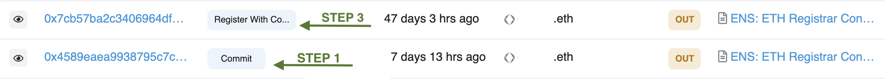

# Why isn't my ESP Name in my wallet?

Por favor, verifique que su registro fue exitoso, por favor verifique su historial de transacciones en [Etherscan.io](https://www.etherscan.io). Los registros con éxito verán dos transacciones: `Commit` **y** `Registro con Configuración`. These transactions represent the Step 1 and Step 3 of the ES registration process.

## Solución de problemas lista

1.  **Compruebe su dirección en** [**Etherscan.io**](https://www.etherscan.io)**.**

    Consulta la dirección de la cartera que se utilizó para registrar un nombre de Ethereum.<!-- _If your address does not show any registration transactions proceed to_ \[#wrong-address\](why-isnt-my-ens-name-in-my-wallet.md#wrong-address "mention")__ -->2.  **Asegúrese de que el paso 1 del registro se haya completado.**

    Busca una transacción con el método de `Commit`. This transaction should be present and have interacted with the [ENS Registrar Controller.](https://etherscan.io/address/0x283af0b28c62c092c9727f1ee09c02ca627eb7f5)__

    _Si la transacción `Commit` no está presente, proceda a_<!--\[#registration-incomplete.\](why-isnt-my-ens-name-in-my-wallet.md#registration-incomplete. "mention")-->__

    _Si no interactuó con el Registrador de ENS, proceda a_<!-- \[#fraudulent-activity\](why-isnt-my-ens-name-in-my-wallet.md#fraudulent-activity "mention")-->__

3.  **Asegúrese de completar el paso 3 del registro.**

    Busca una transacción con el método de `Regístrate con la configuración` presente. This transaction should be present and have interacted with the [ENS Registrar Controller.](https://etherscan.io/address/0x283af0b28c62c092c9727f1ee09c02ca627eb7f5)

    _Si la transacción `Registro con Config` no está presente, proceda a_<!--\[#registration-incomplete.\](why-isnt-my-ens-name-in-my-wallet.md#registration-incomplete. "mention")-->__

    _Si no interactuó con el Registrador de ENS, proceda a_<!-- \[#fraudulent-activity\](why-isnt-my-ens-name-in-my-wallet.md#fraudulent-activity "mention")-->__

## Error de registro

### Dirección incorrecta

Usted registró erróneamente su nombre en otra cartera que usted posee.

**Acción correcta:** _Conecta la cartera correcta a la aplicación ENS. If your ENS name was mistakenly registered to another address you own, you can transfer the name by changing the Registrant. Si no necesita migrarlo a una nueva cartera, you also can point your ENS to any wallet address by setting the Controller._

__

### Registro **incompleto**.

Uno de los pasos se perdió o no se completó. You must complete all the steps to register your ES name fully.

**Acción correcta:** _Debe completar todos los pasos para registrar su nombre ENS._ Ver<!--\[registering-a-name.md\](../../tutorials/registering-a-name.md "mention") -->para revisar el proceso de registro. _Recuerda, tienes siete días después de la segunda transacción para completar el paso 3._

__

### Actividad Fraudulenta

If you did not interact with the ENS Registrar Controller, you likely transacted with a malicious registration contract. Verifique que su registro ha ocurrido en el sitio web oficial, [https://app.ens.domains/](https://app.ens.domains/).

**Acción correcta:** _Abre un ticket en nuestro Discord oficial para informar de cualquier actividad fraudulenta o intento de phishing. Es importante verificar los detalles de todas las solicitudes de firma y llamadas de contrato antes de aceptarlas._

