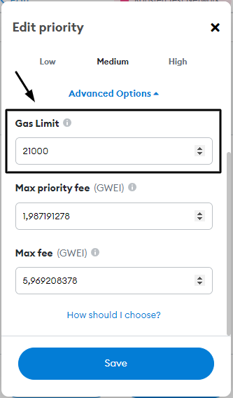
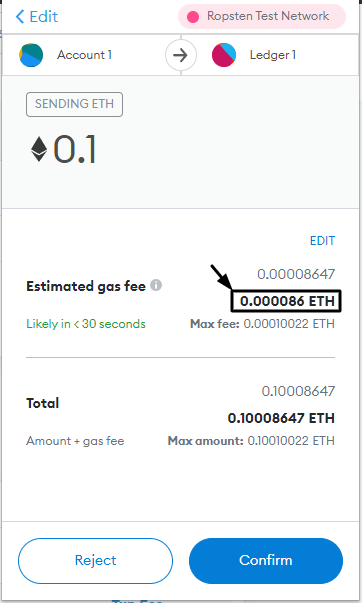
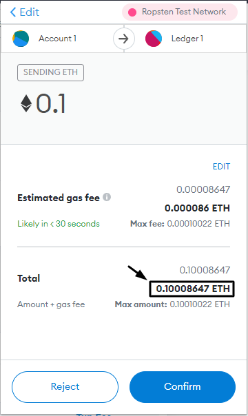

# ¿Qué son las tasas de gas?

Cada vez que realizas una transacción en el blockchain de Ethereum hay comisiones incurridas por ella, en Ethereum esas comisiones se llaman _"Gas"._ Las comisiones actúan como un mecanismo de incentivo para que los mineros recojan su transacción y la codificen en el libro principal de blockchain y tengan tres atributos principales:

### 1. Tarifa de gas (o coste base)

Si se establece muy bajo, la transacción se paralizará, y caerá una vez que el mempool esté lleno, pero no se le cobrará por el gas. Esta comisión se quemó a partir de [EIP-1559](https://notes.ethereum.org/@vbuterin/eip-1559-faq).

### 2. Consejo (o tarifa de prioridad)

Se paga una tarifa de propina o prioridad a los mineros para incluir su transacción en un bloque tan pronto como sea posible.

### 3. Límite de gas

Límite superior a la cantidad de gas que se permite utilizar si se establece demasiado bajo, la transacción fallará y se le cobrará por el gas utilizado hasta ese punto.\

### Siempre revise las transacciones

Las tasas de gas fluctuan constantemente y para usar Ethereum económicamente es una buena idea vigilar siempre el precio actual del gas usando un [rastreador de gas](https://etherscan.io/gastracker) y revisar siempre los costos de transferencia antes de confirmarlos, con el fin de evitar altas cargas debido a aumentos repentinos en las tasas de gas.

#### Saber cómo ajustar los costos de gas

Hay momentos en los que puede necesitar ajustar la configuración de comisión de gas manualmente, tómate tiempo para aprender cómo hacer esto en la billetera que utilizas para evitar cometer errores (costosos) más tarde.\

#### Asegúrate de que la tarifa de gas no es excesiva

#### Asegúrese de que la cantidad total de la transacción es lo que espera

Si las comisiones y el valor de la transacción es lo que usted espera que sea, entonces confirme la transacción.
