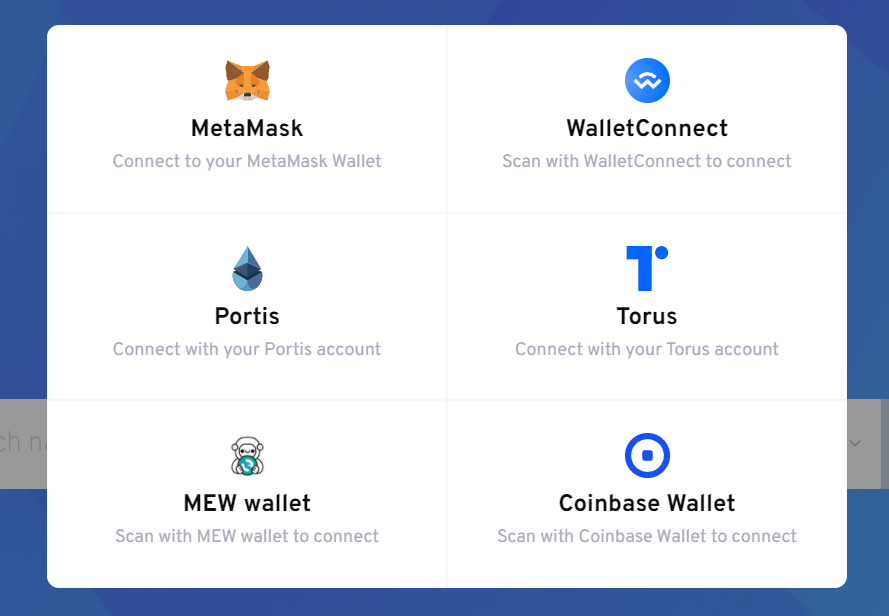
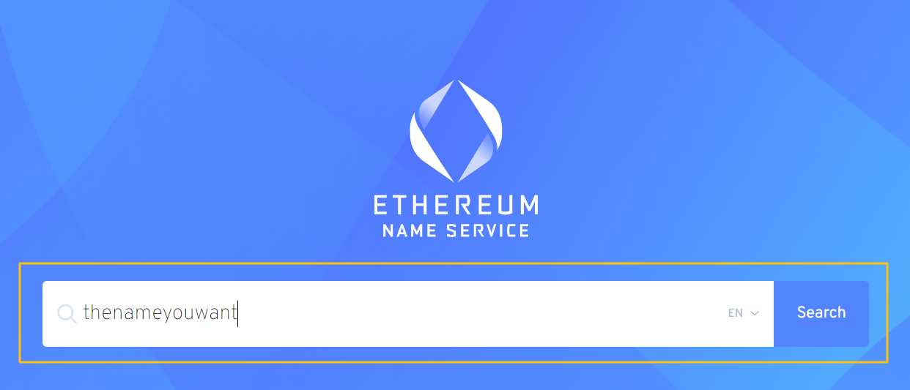
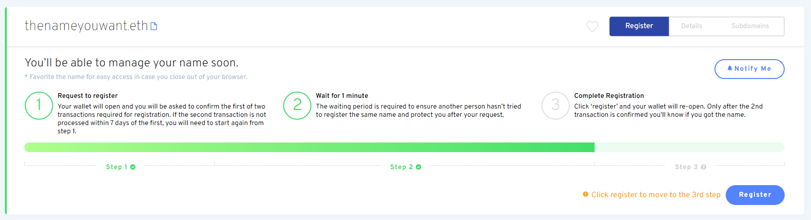

# Enregistrement d'un nom

### Aller au gestionnaire de l'ENS

Rendez-vous sur l' [ENS Manager App](https://app.ens.domains) et connectez votre portefeuille avec le bouton connecter. Assurez-vous que votre portefeuille s'affiche comme _connecté_ ou que l'inscription ne réussira probablement pas.

### Connectez votre portefeuille

Choisissez comment vous connecter à votre portefeuille. Si vous n'êtes pas sûr que votre portefeuille prenne en charge WalletConnect ou non, une liste est fournie sur le site Web de WalletConnect [ici](https://walletconnect.com/registry/wallets).

### Rechercher le nom de l'ENS que vous voulez

Si le nom que vous avez recherché est disponible, cliquez dessus pour continuer l'enregistrement.

### Enregistrement de votre nom d'ENS

L'enregistrement d'un nom d'ENS est un processus en trois étapes afin d'empêcher le front-running, afin que personne ne puisse voler votre nom ENS sous vous pendant que vous êtes en train de l'enregistrer.

#### Étape 1 : Demande d'inscription

Cliquer sur Demande d'inscription lance l'étape 1 du processus en 3 étapes. Une transaction 0ETH est effectuée lorsque votre nom est haché avec une clé secrète afin que personne d'autre ne puisse voir quel nom vous essayez de vous enregistrer. Cette étape entraînera des frais de gaz, ainsi que la dernière étape 3.

Cette clé est stockée dans le stockage local de votre navigateur, alors assurez-vous d'éviter de vider les données locales de votre navigateur avant d'avoir terminé les trois étapes, ou vous serez contraint de répéter l'étape 1 à nouveau.\

C'est une bonne idée de :

* Envisagez d’enregistrer votre nom d’ENS pour plus d’un an afin d’éviter d’avoir à payer des frais de renouvellement pour l’essence chaque année.
* Préférez le nom de l'ENS que vous enregistrez si vous l'oubliez plus tard.

Une fois que vous êtes prêt, cliquez sur "Demande d'inscription".

Vérifiez que le coût de la transaction est ce que vous attendez et confirmez la transaction dans votre portefeuille.

#### Étape 2 : Attendez 1 minute

Une fois que la transaction de l'étape 1 est terminée, il y a une période d'attente d'une minute afin d'éviter qu'elle ne soit exécutée en premier.

#### Étape 3 : Inscription

Après avoir attendu 1 minute et l'étape 2 a terminé, il est temps de _enregistrer_ votre nom ENS. Vous avez jusqu'à 7 jours pour le faire à partir du moment où vous avez terminé votre opération Étape 1, mais gardez à l'esprit que votre nom ENS n'est pas réservé pour vous jusqu'à ce que vous l'inscriviez __.

Il serait peut-être bon de vérifier à nouveau que les coûts du gaz sont encore faibles pendant cette période. Une fois que vous êtes prêt à continuer, cliquez sur le bouton Enregistrer et confirmez la transaction dans votre portefeuille.\

Félicitations ! Si toutes les transactions ont été effectuées avec succès, vous devriez maintenant être le fier propriétaire de votre propre nom ENS !

 