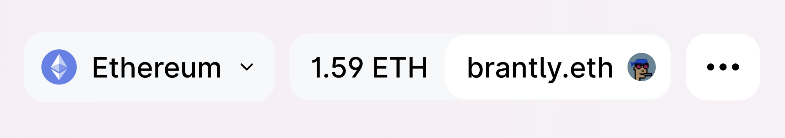
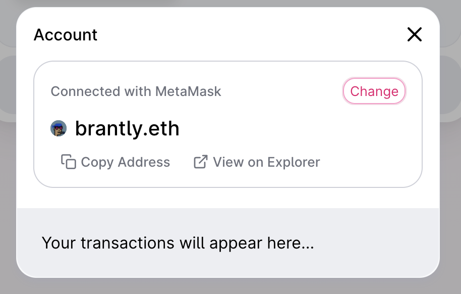

# Réglage de votre avatar de profil

**AVERTISSEMENT**: L'assistance dans le Gestionnaire ENS en ce moment est très manuelle ! Une nouvelle conception du responsable de l'ENS sera bientôt publiée pour rendre cela beaucoup plus gérable. Pour l'instant, cependant, voici un guide.

### Avez-vous un nom ENS ?

Si vous n'avez pas encore de nom d'ENS, vous pouvez enregistrer un nom de domaine ENS ou importer un nom de domaine DNS que vous possédez déjà sur l'application [. ns.domains](https://app.ens.domains). Vous pouvez définir un avatar NFT pour l'un ou l'autre type de nom d'ENS.

### Votre enregistrement principal ENS Name est-il défini ?

Un nom primaire est un enregistrement dont vous possédez le nom ENS qui représente votre portefeuille.

Si vous n'avez pas de nom primaire, vous pouvez suivre <!-- **Primary Name Guide Link ** --> à titre de guide.

### Êtes-vous prêt à dépenser de l'ETH en frais de gaz?

Vous êtes probablement au courant des frais de gaz sur le réseau Ethereum si ce n'est pas le cas, vous pouvez<!-- \[read here\](/references/ethereum/what-are-gas-fees.md) -->, et puisque cette transaction sera **à la chaîne**, cela signifie que vous **devrez dépenser de l'ETH**. Si vous êtes d'accord avec ça, parfait! Vous pouvez continuer à suivre les étapes

### Paramétrage de la notice d'Avatar

Allez sur [app.ens.domains](https://app.ens.domains) et recherchez votre nom ENS pour accéder à la page des enregistrements. Assurez-vous de vous connecter avec le portefeuille qui est le contrôleur du nom de l'ENS. Vous devriez voir un bouton `AJOUTER / MODIFIER LE RECORD`. Cliquez dessus et faites défiler vers le bas jusqu'à ce que vous trouviez le dossier de texte d'avatar.


Vous pouvez mettre un lien HTTPS ou un hachage IPFS dans un fichier dans ce champ, mais si vous souhaitez mettre un **NFT que vous possédez**, alors vous pouvez le saisir **avec ce format**:

```
eip155:1/[norme NFT]:[adresse du contrat pour la collection NFT]/[ID du jeton ou le numéro de la collection]
```

Vous pouvez trouver toutes ces informations dans la section `Détails` de votre NFT sur OpenSea.


Cliquer sur le texte bleu en face de `Adresse du contrat` vous mènera à sa page Etherscan, où vous pourrez copier l'adresse complète du contrat.


Dans cet exemple, vous mettriez toutes ces informations comme ceci:

```
eip155:1/erc721:0xb7F7F6C52F2e2fdb1963Eab30438024864c313F6/2430
```

**Attention : le standard de jeton ne peut pas contenir de trait d'union, et doit être en minuscule. Donc, même si OpenSea peut le montrer comme "ERC-721", entrez comme "erc721".**

Comme cela a été mentionné au début de l'article, ce sera beaucoup plus facile à l'avenir. Pour l'instant, cependant, tout doit être fixé et corrigé manuellement, alors soyez conscient des erreurs communes précédentes, ainsi que d'autres telles que:

* Définit le standard de jeton à "erc721", même s'il est en fait "erc1155"
* Utilisation d'un cryptochatty comme NFT, qui est **actuellement non pris en charge**
* Utiliser tout autre NFT qui n'utilise pas entièrement le standard NFT. Si vous n'êtes pas sûr de cela, vous pouvez toujours [demander dans la discorde](https://chat.ens.domains).

Cliquez sur `Enregistrer` une fois que votre NFT correctement formaté a été entré dans le champ texte. Vous serez invité à approuver une transaction dans votre portefeuille. Vous serez invité à approuver une transaction dans votre portefeuille. Une fois que cette transaction a montré qu'elle est confirmée sur Etherscan, votre avatar est configuré !

### Essayez-le!

Rafraîchissez la page dans l'application Gestionnaire d'ENS, et vous devriez voir votre nom et votre avatar de l'ENS sur le côté gauche. Cela peut prendre quelques secondes pour que votre avatar NFT apparaisse, mais nous travaillons à réduire cela dans le futur.


Ensuite, allez à OpenSea et recherchez votre nom. Rafraîchissez les métadonnées (cliquez sur le bouton flèche circulaire en haut à droite), attendez quelques minutes, puis rechargez la page. Votre avatar devrait maintenant être l'image de fond de l'image NFT de votre nom ENS !


Maintenant, allez visiter [app.uniswap.org](https://app.uniswap.org) et connectez votre portefeuille. Donnez-lui quelques secondes, et votre nom et votre avatar de l'ENS devraient apparaître !



Cliquez sur votre nom et vous le verrez à nouveau.


Enfin, allez sur [app.1inch.io](https://app.1inch.io) et connectez votre portefeuille. De la même manière que Uniswap, vous pourrez d'abord le voir en haut à droite.



De plus, vous serez en mesure de le voir si vous cliquez sur votre nom ENS.


Voilà! Amusez-vous avec votre nouvel avatar NFT !
