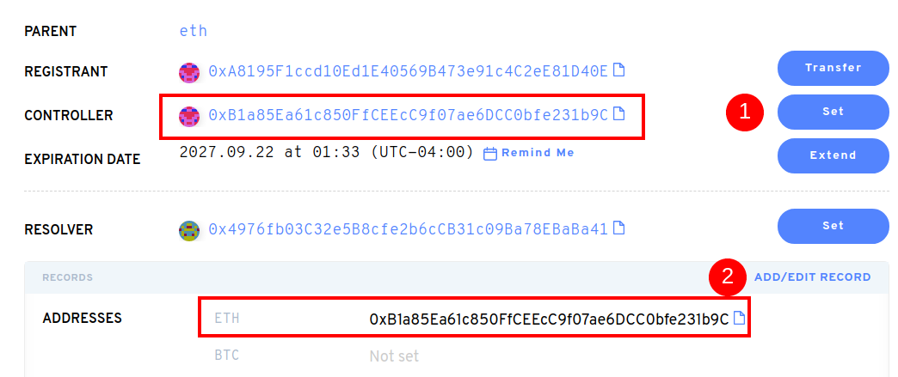

# Comment puis-je utiliser un nom ENS après l'avoir acheté sur un marché secondaire?

Après avoir acheté votre nom ENS sur un marché secondaire comme OpenSea ou Rarible, vous devriez vous diriger vers l' [Application ENS](https://app.ens.domains). Une fois que votre portefeuille y est connecté, vous pouvez mettre à jour les enregistrements pour votre nom ENS. Vous pouvez remarquer que seul le Déposant a changé d'adresse de votre portefeuille. En cliquant sur « Définir », vous mettrez à jour l'enregistrement du contrôleur. La mise à jour des enregistrements de nom de l'ENS mettra à jour l'état de la blockchain, donc cela va entraîner du gaz.

Après avoir paramétré le contrôleur, vous pouvez mettre à jour l'enregistrement d'adresse ETH. Toute cryptomonnaie (ERC20) ou NFTs(ERC721) envoyée au nom de votre ENS arrivera à l'adresse Ethereum qui y est enregistrée.

**Important :** Sans mettre à jour ces enregistrements après achat sur un marché secondaire, les transactions de cryptomonnaies envoyées à votre . Le nom du e e n'arrivera pas dans votre ou vos portefeuilles par défaut.

Votre nom ENS peut stocker des adresses de paiement pour plus qu'Ethereum. Les devises que vous pouvez ajouter, incluent la BTC, la LTC, le DOGE, et _beaucoup de_ plus.

