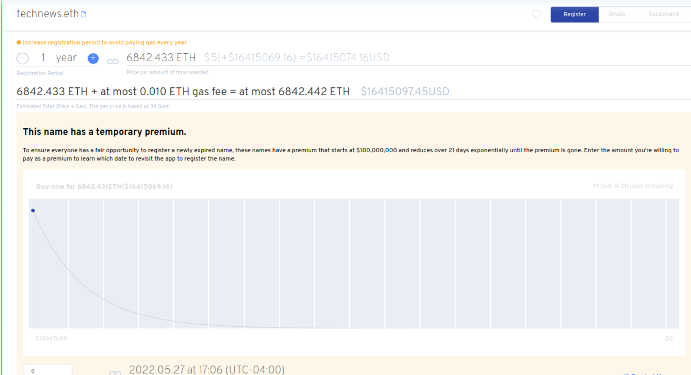

# Qu'est-ce qu'une vente aux primes?

### À propos des enchères premium

Un nom ENS expiré entrera dans un délai de grâce de 90 jours. Après la fin de la période de grâce, tout le monde pourra enregistrer le nom à nouveau. Cependant, les noms qui ont passé la période de grâce entrent dans une vente aux enchères en néerlandais de 21 jours commençant par un prix de prime qui est actuellement fixé à 100 $, 00,000 USD.

Sur 21 jours, le prix de la prime diminuera jusqu'à ce que les frais de prime soient de 0 $. Le prix de la prime diminue en utilisant une décomposition non linéaire. Cela signifie que la prime tombe rapidement du prix de départ très élevé et ralentit vers la fin de la fenêtre premium de 21 jours. Un nom peut être enregistré dans la vente aux enchères de prime en choisissant le temps à acheter.

Dans l'interface utilisateur de l'application [ENS](https://app.ens.domains), en cliquant sur le tableau de bord d'un nom de l'ENS en prime vous obtiendrez une estimation du prix de la date et de l'heure choisies. Vous aurez besoin de suffisamment d'Ether pour payer les frais de prime plus les frais d'inscription annuels.

### Pourquoi avoir une vente aux enchères primes?

Avec l'augmentation de la popularité des noms ENS, les noms disponibles pour être ré-enregistrés seront immédiatement achetés par les bots, et les mineurs en front, pour sniper un nom de l'ENS avant que d'autres puissent l'acheter. Le prix de départ actuel de la vente aux enchères premium est de 100 000 000 $, ce qui se dégrade à 0 $ par la fenêtre 21 premium. Cette prime en baisse est en fait une vente aux enchères néerlandaise.

On ne s'attend pas à ce que quelqu'un achète un nom à un prix aussi élevé mais il empêche ceux qui exécutent des scripts de profiter de la mécanique des ventes aux enchères.

### Lecture supplémentaire:

* [\[EP9\]\[Exécutable\] Changer en prix Exponentiel Premium Oracle](https://docs.ens.domains/v/governance/governance-proposals/ep9-executable-change-to-exponential-premium-price-oracle)
