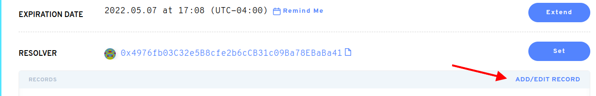

# Adicione outros endereços de carteira ao seu nome ENS.

Definir um endereço não-Ethereum para o seu nome permite que aplicativos que suportam ENS usem seu Nome Ethereum para conectar a outros endereços de criptomoedas. Você pode configurar endereços não-ETH no Gerenciador de domínio em [https://app.ens.domains](https://app.ens.domains/).

Recomendamos definir vários endereços de uma só vez para economizar nas taxas de gás. Adicionar ou remover criptomoedas irá incorrer em uma solicitação de assinatura de taxa de gás.

### Como faço para adicionar outras carteiras?

No Gerenciador ENS, você pode adicionar um endereço de criptomoeda, copiando e colando seu endereço de criptomoeda no campo de endereço correspondente.

Se seu tipo de moeda não estiver listado nos campos pré-existentes, encontre o menu de menu e selecione sua moeda. Clique em `ADD/EDIT RECORD`.

Quando você tiver inserido toda a criptomoeda desejada, ou alterou seus outros registros, role para baixo até a parte inferior da página do gerenciador.

**Importante:** Para fazer essas alterações permanentemente, você deve selecionar o botão "Confirmar". Isto irá alterar os dados em on-chain e implicará uma taxa de gás.

