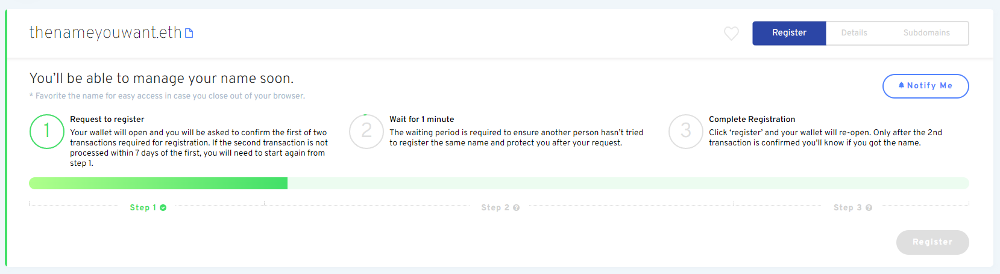

# Registrando um Nome

### Ir para o Gerenciador ENS

Vá para o aplicativo [ ENS Manager](https://app.ens.domains) e conecte sua carteira em 'connect'. Certifique-se de que a sua carteira apareça como _conectado_ ou o registro provavelmente não será bem sucedido.

### Conecte sua carteira

Escolha como conectar com a sua carteira. Caso você não tenha certeza se a sua carteira suporta ou não o WalletConnect, uma lista é fornecida no site do WalletConnect [aqui](https://walletconnect.com/registry/wallets).

### Procure pelo nome ENS que você deseja

Desde que o nome que você procurou esteja disponível, clique nele para continuar com o registro.

### Registrando seu nome ENS

Registrar um nome ENS é um processo em três etapas a fim de impedir 'front-running', para que ninguém possa roubar o seu nome ENS enquanto você estiver em processo de registro.

#### Passo 1: Solicitar registro

Clicando em Solicitação de Registro inicia o Passo 1 do processo de 3 Passos. Uma transação 0ETH é realizada onde o seu nome é pressionado com uma chave secreta para que ninguém mais possa ver qual nome você está tentando registrar. Este passo implicará taxas de gás, bem como a etapa 3 final.

Esta chave é gravada no armazenamento local do seu navegador, portanto, certifique-se de evitar limpar os dados locais do seu navegador antes de completar as três etapas, ou você será forçado a repetir a etapa 1 novamente.

É uma boa ideia para:

* Considere registrar o seu nome ENS por mais de 1 ano, para evitar ter de pagar taxas de gás pelas renovações todos os anos.
* Favorite o nome ENS que você está registrando caso mais tarde se esqueça.

Assim que estiver pronto, clique em "Solicitar para Registrar".

Verifique se o custo da transação é o que você espera e confirme a transação na sua carteira.

#### Passo 2: Aguarde 1 minuto

Após a conclusão da transação do Passo 1, há um período de espera de 1 minuto para evitar 'Front-Running'.

#### Passo 3: Registrar

Depois que tiver esperado 1 minuto e o passo 2 tiver concluído, é hora de realmente _Registrar_ seu nome ENS. Você tem até 7 dias para fazer isso quando terminar a sua transação da Etapa 1. mas tenha em mente que seu nome ENS não está reservado até que você _Registre_.

Talvez seja uma boa ideia verificar novamente se os custos do gás ainda são baixos durante este período. Assim que estiver pronto para continuar, clique no botão Registrar e confirme a transação na sua carteira.\

Parabéns! Se todas as transações foram realizadas com sucesso, você deve agora ser o proprietário de seu próprio nome ENS!

 