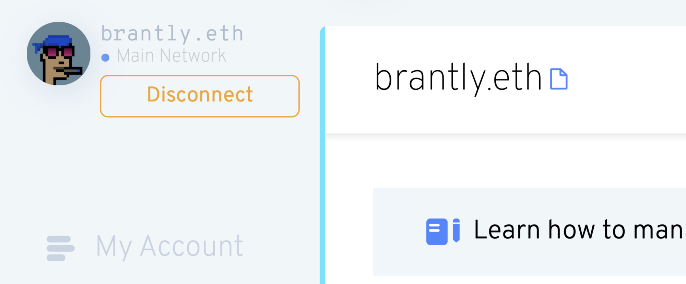
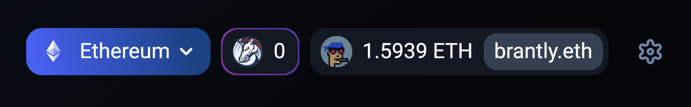

# Definindo o seu Avatar

**AVISO**: o suporte no ENS Manager agora é bastante manual! Um redesign do gerente ENS será lançado em breve para tornar isto muito mais gerenciável. No entanto, por agora, aqui está um guia.

### Você tem um nome ENS?

Se você ainda não possui um nome ENS, você pode registrar um nome ou importar um domínio DNS que você já possui no aplicativo [app.ens.domains](https://app.ens.domains). Você pode definir um avatar NFT para qualquer tipo de nome ENS.

### Seu registro de Nome ENS primário está definido?

Um nome primário é um registro do qual o nome ENS que você possui representa a sua carteira.

Se você não tem um nome primário definido, você pode seguir <!-- **Primary Name Guide Link ** --> como guia.

### Você está disposto a gastar ETH em taxas de gás?

Você provavelmente já está ciente das taxas de gás na plataforma do Ethereum, se não, você pode<!-- \[read here\](/references/ethereum/what-are-gas-fees.md) -->, e uma vez que esta transação será **on-chain**, significa que você **terá de gastar ETH**. Se você estiver bem com isso, perfeito! Você pode continuar seguindo as etapas

### Definindo o registro do avatar

Acesse [app.ens.domains](https://app.ens.domains) e pesquise seu nome ENS para chegar a sua página de registros. Certifique-se de conectar com a carteira que é o Controlador do nome ENS. Você deve ver um botão `ADD/EDIT RECORD`. Clique nele e role para baixo até que você encontre o Registro de Texto do Avatar.


Você pode colocar um link HTTPS ou hash IPFS em um arquivo neste campo, mas se você quiser colocar uma NFT **que você possui**, então você pode digitá-lo **com este formato**:

```
eip155:1/[NFT standard]:[contract address for NFT collection]/[token ID or the number it is in the collection]
```

Você pode encontrar todas estas informações na seção `Details` da sua NFT no OpenSea.


Clicando no texto azul de `Contract Address` levará você à página de Etherscan, onde você pode copiar o endereço do contrato completo.


Neste exemplo, você colocaria todas estas informações desta forma:

```
eip155:1/erc721:0xb7F7F6C52F2e2fdb1963Eab30438024864c313F6/2430
```

****Aviso**: O padrão de token não pode conter um hífen, e deve estar em letras minúsculas. Portanto, embora o OpenSea possa mostrá-lo como "ERC-721", digite-o como "erc721".**

Como mencionado no início do artigo, isto será muito mais fácil no futuro. Por enquanto, porém, tudo precisa ser ajustado e corrigido manualmente. Portanto, esteja ciente dos erros comuns anteriores, bem como outros, como por exemplo:

* Definindo o padrão de token para "erc721", mesmo que na verdade seja "erc1155"
* Usar um criptokitty como NFT, que **atualmente não é suportado **
* Usar qualquer outra NFT que não use totalmente o padrão NFT. Se você não tem certeza disso, você pode sempre [perguntar no Discord](https://chat.ens.domains).

Clique em `Save` assim que sua NFT esteja formatada corretamente no campo de texto. Você será solicitado a aprovar uma transação em sua carteira. Você será solicitado a aprovar uma transação em sua carteira. Assim que esta transação mostrar como confirmada no Etherscan, seu avatar estará pronto!

### Experimente!

Atualize a página no aplicativo ENS Manager e você verá seu nome e avatar ENS no lado esquerdo. Talvez leve alguns segundos para o seu avatar da NFT aparecer, mas estamos trabalhando para reduzir isso no futuro.



Em seguida, vá para OpenSea e procure pelo seu nome. Atualize os metadados (clique no botão de seta circular no canto superior direito), aguarde alguns minutos e depois recarregue a página. Seu avatar deve agora ser a imagem de fundo da imagem NFT de seu nome ENS!


Agora visite [app.uniswap.org](https://app.uniswap.org) e conecte sua carteira. Espere alguns segundos, e o seu nome ENS e avatar devem aparecer!


Clique no seu nome e você o verá novamente.


Por fim, vá para [app.1inch.io](https://app.1inch.io) e conecte sua carteira. Da mesma forma que Uniswap, você poderá primeiro vê-la no topo direito.


Além disso, você poderá vê-lo se você clicar no seu nome ENS.



Está pronto! Divirta-se com o seu avatar NFT recém-definido!
