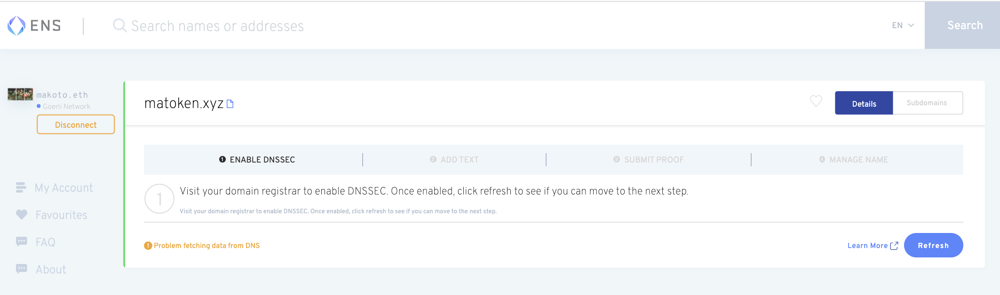
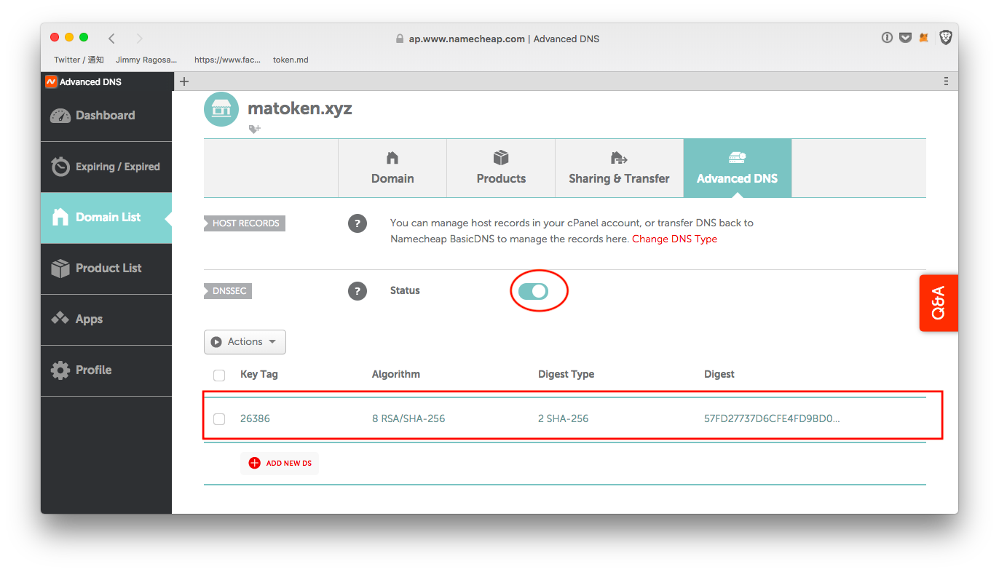
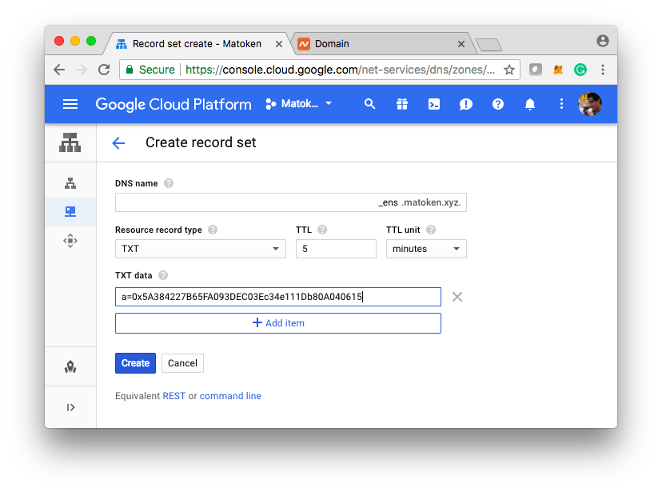
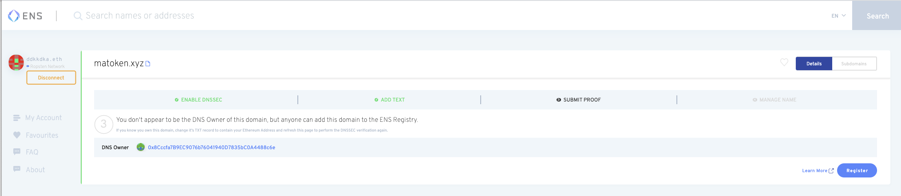
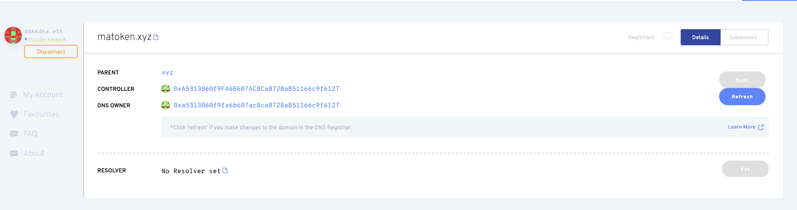

# Importar um domínio DNS para ENS

### Introdução

DNSSEC (Extensões de Segurança do Sistema de Nome de Domínio) estabelece uma cadeia de confiança da chave raiz que assinada pela ICANN (.) e abaixo através de cada chave. Dado que o DNSSEC está habilitado e um endereço ETH é colocado no subdomínio do domínio que você possui (por exemplo: `_ens.yourdomain. ld`), ENS manager permite que qualquer pessoa envie o hash da cadeia para `smart contract (contrato inteligente) DNSSEC Oracle`

### Passo 1

Quando você entrar pela primeira vez no gerenciador do ENS, você verá algo como abaixo.

Se o seu provedor de DNS já suporta domínios assinados pelo DNSSEC, tudo o que você precisa fazer é ativar a opção no Gerenciador de DNS. Se não fizerem, você precisará migrar para alguém que o faça.

Recomendamos o [EasyDNS](https://www.easydns.com) ou [Google Cloud DNS](https://cloudplatform.googleblog.com/2017/11/DNSSEC-now-available-in-Cloud-DNS.html). O guia de instalação do EasyDNS para DNSSEC está [aqui](https://fusion.easydns.com/Knowledgebase/Article/View/18/7/dnssec), enquanto o Google está [aqui](https://cloud.google.com/dns/dnssec-config). Qualquer provedor que você precisar, certifique-se de selecionar assinaturas RSA e hashing SHA256 para não incorrer em elevadas taxas de gás ao tentar vincular seu nome ENS às chaves ECDSA.

#### Uma lista de provedores de hospedagem populares e quais tipos chave eles suportam para suas configurações de DNSSEC

* **Native ENS Integration**
  * [easyDNS](https://easydns.com/)
* **RSA/SHA-256 / ECDSA**
  * [Google Cloud DNS](https://cloud.google.com/dns)
  * [Bluehost](https://www.bluehost.com/)
  * [Hostinger](https://hostinger.com)
  * [Hostgator](https://hostgator.com)
* **Apenas ECDSA**
  * [GoDaddy](https://www.godaddy.com)
* **Nenhum suporte a DNSSEC**
  * [Wordpress](https://www.wordpress.com) _quando usado como provedor DNS._

### Passo 2: Adicionando um registro TXT

O Registro DNS no ENS procura por um registro TXT com um nome e formato específicos para verificar qual endereço Ethereum deve receber a propriedade do domínio. Para reivindicar a propriedade de [meudominio.xyz](https://mydomain.xyz), crie um registro TXT na sua zona DNS, \_[ens.mydomain. yz](https://ens.mydomain.xyz), com dados de texto do formulário a=0x1234... onde 0x1234... é o endereço Ethereum para o qual você deseja dar o controle do registro ENS.

### Passo 3: Registrando o nome em ENS

Uma vez chegado a esta etapa, você pode completar o resto com o ENS gerenciador. Simplesmente pressione "Registrar" e envie a transação.

### Passo 4: Ir para o gerenciador

