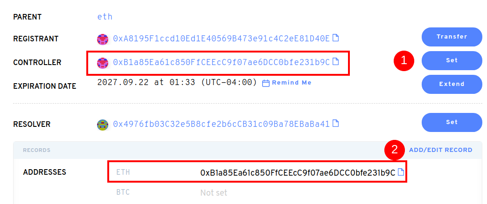

# How do I use an ENS name after purchasing it on a secondary marketplace?

Depois de comprar seu nome ENS em um mercado secundário como OpenSea ou Rarible, você deve ir na próxima vez para o [ENS App](https://app.ens.domains). Uma vez conectando sua carteira, você poderá atualizar os registros para o seu nome ENS. Você pode notar que apenas o Registrante mudou para seu endereço de carteira. Ao clicar em "Configurar", você atualizará o registro Controlador. Atualizando registros de nome ENS irá atualizar o estado da blockchain, então isto irá gerar gás.

Depois de definir o controlador, você pode atualizar o registro de endereço ETH. Qualquer criptomoeda (ERC20) ou NFTs(ERC721) enviada para o seu nome ENS chegará ao endereço de Ethereum salvo.

**Importante:** Sem atualizar esses registros após a compra em um mercado secundário, as transações de criptomoedas enviadas para seu nome .eth não chegará à(s) sua(s) carteira(s) por padrão.

O seu nome ENS pode armazenar endereços de pagamento mais do que apenas Ethereum. As moedas que você pode adicionar, incluem BTC, LTC, DOGE e _muitas_ outras.

