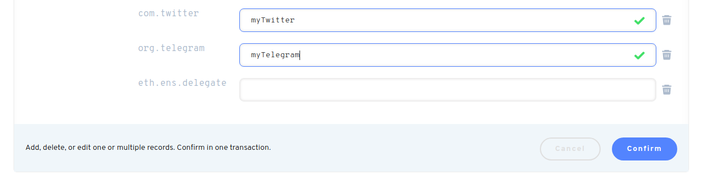

# O que são os registos de texto e como funcionam?

## Registros de Texto

Registros de texto permitem que você anexe e armazene dados de texto disponíveis publicamente e arbitrários para o seu nome de Ethereum. Os seus registros de texto são essencialmente metadados controlados pelo usuário, legíveis por humanos para as aplicações de referência e uso. Como seus registros de texto são criados por você e armazenados na blockchain Ethereum, eles possibilitam um perfil de usuário autônomo e descentralizado. Isto significa que suas informações e perfil podem começar a escapar da arquitetura centralizada da Web2.

Com o [ENS Metadata Service](https://metadata.ens.domains/docs) esses registros de texto não estão confinados a Blockchain Ethereum e podem ser referenciados pelo DNS.

Para obter dados técnicos sobre a EIP que tornam isso possível, veja:[EIP-634](https://eips.ethereum.org/EIPS/eip-634).

### Como posso adicionar um registro de texto?

No [ENS App](https://app.ens.domains), você pode adicionar um registro clicando no link 'Add/Edit' na guia 'registros':

Você deve ver algumas caixas drop down que lhe permitirão optar por adicionar um registro "TEXTO", o tipo de registro de texto (por exemplo, "URL"), e então digitar as informações para esse registro:

Quando estiver pronto, clique em "Confirmar" para enviar a transação, e uma vez extraída, você deve ver a transação aparecer abaixo.

**Nota:** Registros de texto, como todos os registros ENS, são publicamente visíveis.

### Tipos de Campos de Texto.

Embora os usuários possam definir facilmente novos registros de texto, existem várias chaves estabelecidas no Gerenciador de Domínio ENS.

#### Chaves Globais Comuns

Chaves globais devem conter apenas letras minúsculas, números e hífens.

* **Avatar** - Uma URL em minúsculas para uma imagem usada como avatar ou logotipo. Tudo em minúsculas.
* **Descrição** - Uma descrição do nome.
* **Display -** Um nome de exibição canônica para o nome ENS.
* **E-mail -** Um endereço de e-mail
* **Palavras-chave** - Uma lista de palavras-chave separadas por vírgula, ordenadas pela mais significativa em primeiro lugar.
* **URL -** Uma URL do site

#### Outras Chaves de Serviços

Chaves de serviço devem ser compostas por uma notação de ponto invertido (veja abaixo exemplos) e conter pelo menos um ponto. Um usuário pode criar suas próprias chaves de serviço aderindo a este formato.

* **com.github** - Um Github username.
* **com.twitter** - Um nome de usuário do Twitter.
* **io.keybase -** Um nome de usuário Keybase.
* **org.telegram -** Um Nome de Usuário do Telegram.

**Nota:** Os nomes de usuários **NÃO devem** incluir o símbolo "@" ou conter a URL completa para o perfil do usuário.

