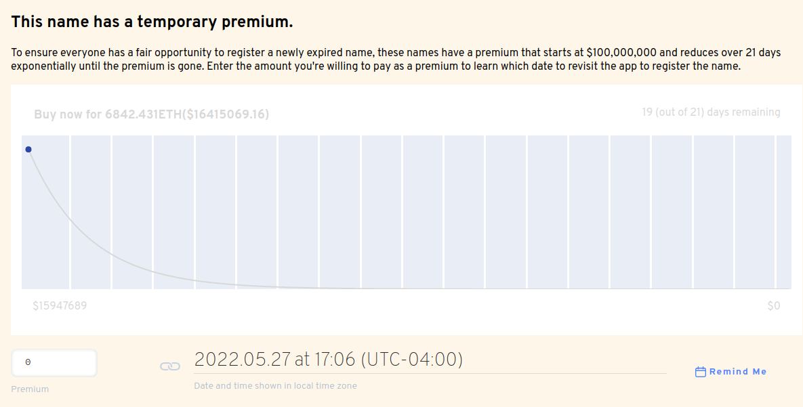

# O que é um período de carência?

O período de **carência** é o período de 90 dias que é dado após um nome ENS expirar. Durante este tempo, o nome não pode ser transferido para um novo Registrante (proprietário) e os registros não podem ser atualizados. O nome ENS tem de ser renovado para que deixe o período de carência e tenha uma data de validade para o futuro.

Se o nome ENS não for renovado antes do fim do período de carência, o nome entrará num leilão premium holandês por 21 dias. Ao final de 21 dias, o nome ENS não terá mais 'premium' anexado e poderá ser registrado com a taxa anual padrão. O leilão premium começa atualmente em US$ 100.000.000 e diminui com uma decadência não linear ao longo de 21 dias. Se o nome for comprado durante o período premium, o comprador pagará o preço do leilão premium e a taxa anual padrão.

### Leitura adicional:<!-- * \[What is a premium auction?\](what-is-a-premium-auction.md) -->
