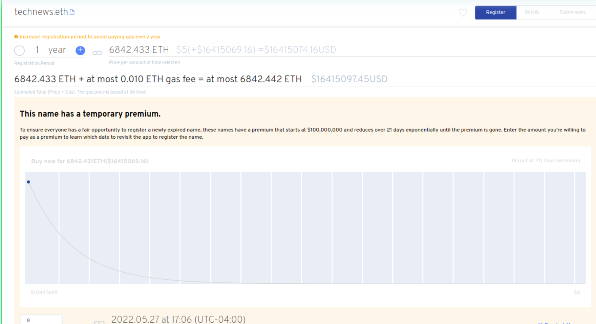

# What is a premium auction?

### Sobre os leilões premium

Um nome ENS expirado primeiro entra em um período de carência de 90 dias. Após o término do período de carência, qualquer pessoa poderá registrar o nome novamente. Entretanto, os nomes que passaram o período de carência entram em um leilão holandês de 21 dias, começando com um preço premium que está atualmente fixado em US$ 100.000.000,00.

Ao longo de 21 dias, o preço premium diminuirá até que a taxa premium seja de $0. O preço premium diminui utilizando uma decadência não linear. Isto significa que o "premium" cai rapidamente do preço de início muito elevado e diminui para o final da janela premium de 21 dias. Um nome pode ser registrado dentro do leilão premium, escolhendo o momento da compra.

Na interface de usuário do [ENS App](https://app.ens.domains), clicando no gráfico de linhas para um nome ENS em premium dará uma estimativa de preço para a data e horário específicos escolhidos. Você precisará de Ether suficiente para pagar a taxa premium mais a taxa de registro anual.

### Por que ter um leilão premium?

Com o aumento da popularidade dos nomes ENS, os nomes disponíveis para serem re-registrados seriam instantaneamente comprados por bots, e por mineiros de primeira linha, para ceder um nome ENS antes que outros o pudessem comprar. O preço inicial atual para o leilão premium é de $100.000.000, que diminui para $0 sobre a janela premium. Este prêmio decrescente é efetivamente um leilão holandês.

Não se espera que alguém compre um nome a um preço tão alto, mas isso impede que aqueles que executam scripts tirem proveito da mecânica do leilão.

### Leitura adicional:

* [\[EP9\]\[Executável\] Mudança para Preço Premium Exponencial Oracle](https://docs.ens.domains/v/governance/governance-proposals/ep9-executable-change-to-exponential-premium-price-oracle)
