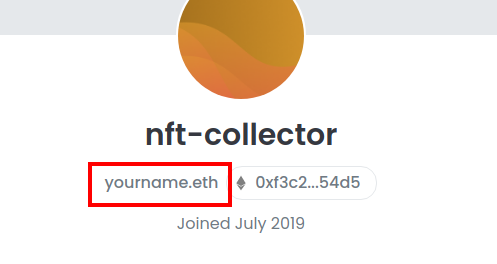

# O que é um nome primário?

### Nome ENS Primário

O nome ENS primário é o registro reverso que resolve um endereço de carteira para um nome ENS.&#x20;

Definir seu registro Primário do Nome ENS permitirá que o dApps encontre seu nome ENS quando estiver se conectando com a sua carteira Ethereum. Por exemplo, uma carteira Ethereum com um nome ENS primário mostrará primaryname_.eth_ quando conectado a Uniswap. No OpenSea, seu perfil irá mostrar o seu nome ENS primário na sua página de perfil. Isso acontece porque o OpenSea se integra com ENS e lê o registro reverso para encontrar o nome .eth.

Embora normalmente seja, o nome principal não precisa ser a mesma carteira que o proprietário do nome ENS ou Registrante. Desde que a carteira Ethereum seja definida como registro de endereço ETH, essa carteira pode selecionar o nome ENS como sua seleção de nome primário.

Para selecionar um nome ENS primário, vá para o [ENS App](https://app.ens.domains) e faça o login com sua carteira. Uma vez logado, clique em "My Account" Então você será capaz de escolher um nome de ENS primário para associar com sua carteira. Apenas nomes ENS com sua carteira no registro de endereço ETH estarão disponíveis na lista suspensa como um nome primário.

**Nota:** O endereço da carteira pode ter apenas um nome Primário.

### Leitura adicional:

