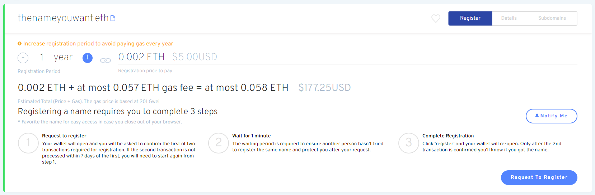

# Por que há 3 passos para o registro?

Há três etapas envolvidas no registro de um nome ENS que se destina a resolver o problema de front-running.

### Passo 1: Solicitar registro

O compromisso no Passo 1 hashes uma chave secreta gerada e arquivada no armazenamento local de seu navegador e hashes com seu endereço de carteira e nome ENS para que você possa mais tarde (dentro de 7 dias) solicitar o seu registro sem revelá-lo publicamente.

**Nota:** Concluir o Passo1 não _reserva ou mantém_ o nome ENS. O nome não será registrado até que o Passo 3 termine.

### Passo 2: Aguarde 1 minuto

Um período de espera de 1 minuto começa a impedir a front-running do registro do nome ENS.

### Passo 3: Registrar

A transação de registro é realizada e o nome do ENS está registrado; a NFT ERC-721 para o nome ENS é cunhado e transferida para a carteira do registro.

### Conclusão

Se um minerador quiser tentar executar este processo, na frente eles teriam que enviar seu próprio segredo de hashed, esperar 1 minuto e registrar o nome. Como eles não podem reter sua transação por um minuto, eles não irão fazer isso, e o minerador não pode usar o segredo comparado ao hash anterior.
