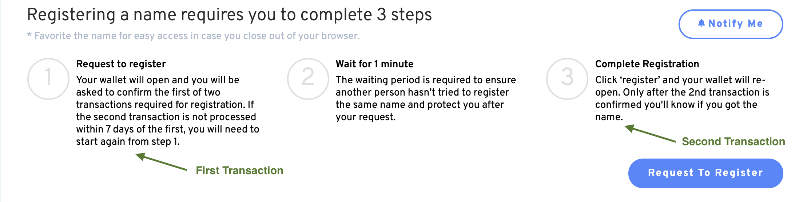

# Por que meu Nome ENS não está na minha carteira?

Por favor, confirme se o seu registro foi bem-sucedido, verificando seu histórico de transações no [Etherscan.io](https://www.etherscan.io). Os registros bem sucedidos serão registrados em duas transações: `Commit` e uar `Register with Config`. Essas transações representam a Passo 1 e o Passo 3 do processo de registro ENS.

## Lista de verificação para solução de problemas

1.  **Verifique seu endereço no** [**Etherscan.io**](https://www.etherscan.io)**.**

    Consultar o endereço da carteira que foi usado para registrar um Nome de Ethereum.<!-- _If your address does not show any registration transactions proceed to_ \[#wrong-address\](why-isnt-my-ens-name-in-my-wallet.md#wrong-address "mention")__ -->2.  **Certifique-se de que o Passo 1 do registro esteja completo.**

    Procure por uma transação com o método de `Commit`. Esta transação deve estar presente e ter interagido com o [Controlador de Registro ENS.](https://etherscan.io/address/0x283af0b28c62c092c9727f1ee09c02ca627eb7f5)__

    _Se a transação `Commit` não estiver presente, prossiga_<!--\[#registration-incomplete.\](why-isnt-my-ens-name-in-my-wallet.md#registration-incomplete. "mention")-->__

    _Se você não interagiu com o Registro ENS, prossiga_<!-- \[#fraudulent-activity\](why-isnt-my-ens-name-in-my-wallet.md#fraudulent-activity "mention")-->__

3.  **Certifique-se de que o Passo 3 do registro esteja concluído.**

    Procure por uma transação com o método de `Register With Config` presente. Esta transação deve estar presente e ter interagido com o [Controlador de Registro ENS.](https://etherscan.io/address/0x283af0b28c62c092c9727f1ee09c02ca627eb7f5)

    _Se a transação `Commit` não estiver presente, prossiga_<!--\[#registration-incomplete.\](why-isnt-my-ens-name-in-my-wallet.md#registration-incomplete. "mention")-->__

    _Se você não interagiu com o Registro ENS, prossiga_<!-- \[#fraudulent-activity\](why-isnt-my-ens-name-in-my-wallet.md#fraudulent-activity "mention")-->__

## Erros de Registro

### Endereço incorreto

Erro ao registrar seu nome em outra carteira que possui.

**Ação Corretiva:** _Conecte a carteira correta à aplicação ENS. Se seu nome ENS foi erroneamente registrado em outro endereço que você possui, você pode transferir o nome mudando o Registrante. Se você não precisa migrá-lo para uma nova carteira, você também pode apontar seu ENS para qualquer endereço de carteira definindo o Controlador._

__

### Registro **Incompleto**

Uma das etapas foi perdida ou não foi concluída. Você deve concluir todas as etapas para registrar seu nome ENS completamente.

**Ação Corretiva:** _Você precisa completar todas as etapas para registrar seu nome ENS._ Veja<!--\[registering-a-name.md\](../../tutorials/registering-a-name.md "mention") -->para revisar o processo de registro. _Remember, you have seven days after the second transaction to complete Step 3._

__

### Atividades Fraudulentas

Se você não interagiu com o controlador de registro ENS, você provavelmente realizou transações com um contrato de registro malicioso. Verifique se o seu registro ocorreu no site oficial, [https://app.ens.domains/](https://app.ens.domains/).

**Ação corretiva:** _Abra um ticket no nosso Discord oficial para relatar qualquer atividade fraudulenta ou tentativa de phishing. É importante verificar os detalhes de todas as solicitações de assinatura e chamadas de contrato antes de aceitá-las._

