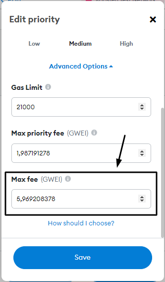
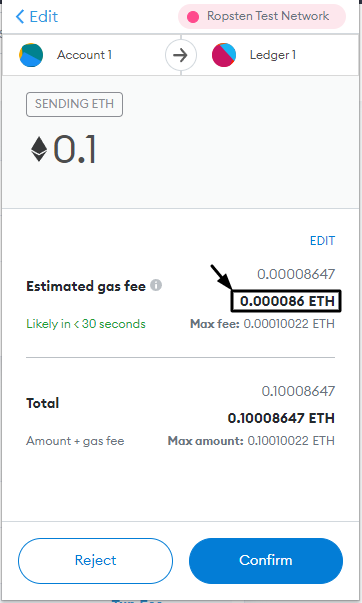

# O que são taxas de gás?

Sempre que você faz uma transação na blockchain Ethereum há taxas incorridas por ela, no Ethereum essas taxas são chamadas _"Gás"._ As taxas atuam como um mecanismo de incentivo para os mineiros pegarem sua transação e codificarem-na no registro da blockchain e têm três atributos principais:

### 1. Taxa de Gás (ou custo base)

Se definido como muito baixo, a transação ficará parada e cairá quando o mempool estiver cheio, mas você não será cobrado pelo gás. Esta taxa é queimada a partir da [EIP-1559](https://notes.ethereum.org/@vbuterin/eip-1559-faq).

### 2. Dica (ou taxa de prioridade)

Uma dica ou taxa de prioridade é paga para incentivar os mineradores a incluírem sua transação em um bloco o mais rápido possível.

### 3. Limite de Gás

O limite máximo para a quantidade de gás permitida para ser usado, se definido como muito baixo a transação falhará e você será cobrado pelo gás usado até aquele ponto.\

### Sempre revisar as transações

As taxas de gás Ethereum flutuam constantemente e para usar o Ethereum economicamente é uma boa ideia estar sempre de olho no atual preço de gás usando um [rastreador de gás](https://etherscan.io/gastracker) e sempre revisar os custos de transferência antes de confirmar, a fim de evitar a cobrança de taxas elevadas devido a picos súbitos em taxas de gás.

#### Saiba como ajustar os custos de gás

Há momentos em que você pode precisar ajustar as configurações da taxa de gás manualmente, use seu tempo para aprender como fazer isso na carteira que você usa, para evitar erros (custos) mais tarde.\

#### Certifique-se de que a taxa de gás não seja excessiva

#### Certifique-se de que o valor total da transação é o que você espera

Se as taxas e o valor da transação são os valores que você espera, então confirme a transação.
