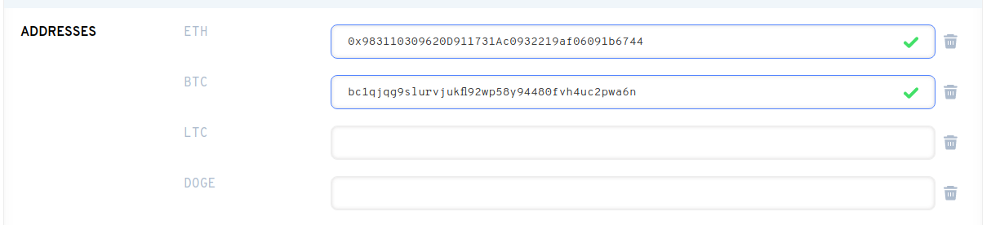
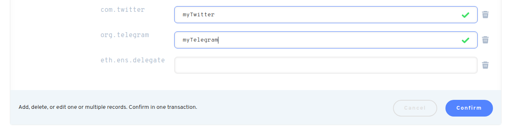

# Добавьте другие адреса кошелька в ваше имя ENS.

Установка адреса не Ethereum в ваше имя позволяет dApps использовать Ethereum Name для подключения к другим криптовалютным адресам. Вы можете настроить не-ETH-адреса в диспетчере доменов на странице [https://app.ens.domains](https://app.ens.domains/).

Мы рекомендуем установить сразу несколько адресов, чтобы сэкономить на плате за газ. Добавление или удаление криптовалют повлечет за собой запрос на подписку с газовой комиссией.

### Как добавить другие кошельки?

В ENS Manager, вы можете добавить криптовалютный адрес, скопировав и вставив ваш криптовалютный адрес в соответствующее поле адреса.

Если ваш тип монет не указан в существующих полях, найдите выпадающее меню и выберите валюту. Click `ADD/EDIT RECORD`.

Когда вы ввели все ваши желаемые криптовалюты, или внесли изменения в другие записи, прокрутите внизу страницы менеджера.

**Важно:** Чтобы навсегда внести эти изменения, вы должны выбрать кнопку "Подтвердить". Это изменит данные в цепи и повлечет за собой сборы за газ.

