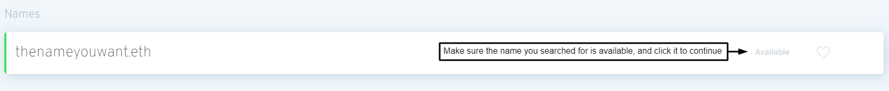

# Регистрация имени

### Перейти к менеджеру ENS

Перейдите в приложение [менеджера ENS](https://app.ens.domains) и подключите ваш кошелек с помощью кнопки подключения. Убедитесь, что ваш кошелек показывает как _подключен_ или регистрация скорее всего не будет успешной.

### Подключите ваш кошелек

Выберите способ подключения к вашему кошельку. Если вы не уверены, поддерживает ли ваш кошелек WalletConnect или нет, то на сайте WalletConnect's [здесь](https://walletconnect.com/registry/wallets).

### Искать нужное название ENS

Если имя, которое вы искали, доступно, нажмите на него, чтобы продолжить регистрацию.

### Регистрация имени ENS

Регистрация имени ENS - это процесс в три шага для предотвращения перезапуска, так что никто не сможет украсть ваше имя от вас в процессе регистрации.

#### Шаг 1: Запрос на регистрацию

Нажатие на запрос на регистрацию инициирует Шаг 1 процесса 3-Шага. 0ETH транзакция выполняется там, где ваше имя хэшируется секретным ключом, чтобы никто больше не мог видеть, какое имя вы пытаетесь зарегистрироваться. На этом этапе будут взиматься газовые сборы, а также финальный этап 3.

Этот ключ хранится в локальном хранилище вашего браузера, поэтому не забывайте очищать локальные данные вашего браузера до того, как вы завершили все три шага, или вам придется повторить шаг 1. \

Это хорошая идея:

* Подумайте о том, чтобы зарегистрировать свое название ЭНС более чем на 1 год, чтобы избежать необходимости платить за обновление газа.
* Избранное для регистрации имя ENS, если вы забудете его позднее.

После того, как вы будете готовы нажать "Запрос на регистрацию".

Проверьте, что стоимость транзакции - это то, что вы ожидаете, и подтвердите транзакцию в вашем кошельке.

#### Шаг 2: Ждать 1 минуту

После того, как транзакция завершится 1 минутный период ожидания для предотвращения перезапуска.

#### Шаг 3: Регистрация

После того, как вы подождите 1 минуту, и шаг 2 завершил свое время _зарегистрировать_ свое имя ENS. You have up to 7 days to do this from the time you finished your Step 1 transaction, but keep in mind that your ENS name isn't reserved for you until you _Register_ it.

Возможно, было бы неплохо дважды проверить, что затраты на газ в это время все еще низки. Как только вы будете готовы продолжить, нажмите кнопку Регистрация и подтвердите транзакцию в вашем кошельке.\

Поздравляем! Если все транзакции прошли успешно, то теперь Вы должны быть гордым владельцем Вашего собственного имя!

 