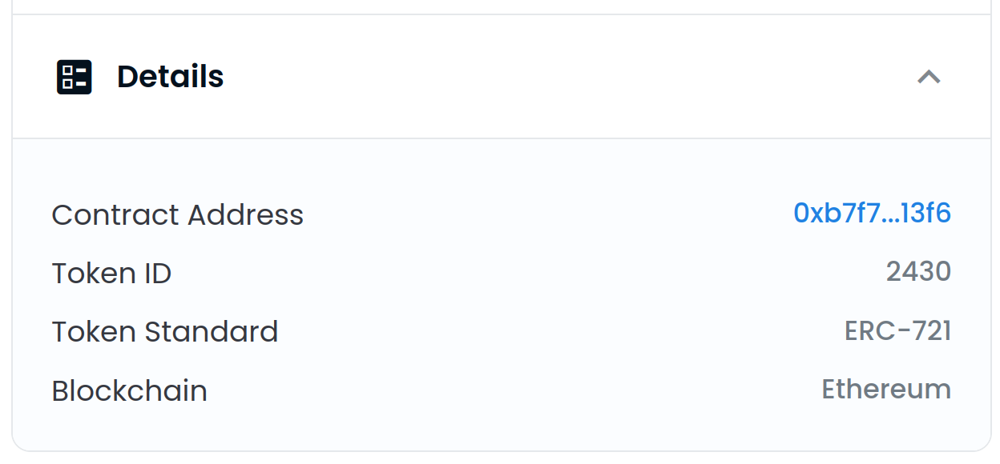

# Настройка аватара профиля

**ПРЕДУПРЕЖДЕНИЕ**: Поддержка в Менеджере ENS сейчас очень ручно! Редизайн менеджера ENS скоро будет выпущен, чтобы сделать его более управляемым. Пока же, вот и руководство.

### У вас есть название ENS?

Если у вас еще нет имени ENS, вы можете зарегистрировать имя ENS или импортировать уже принадлежащее вам DNS доменное имя в приложении [. ns.domains](https://app.ens.domains). Вы можете установить NFT аватар для любого типа ENS.

### Ваш набор записей для первичной записи ENS?

Первичное имя - это запись, в которой ваше имя ENS представляет ваш кошелек.

Если у вас нет первичного имени, вы можете следить <!-- **Primary Name Guide Link ** --> как руководство.

### Are you willing to spend ETH on gas fee?

Возможно, вы знаете, какие газовые сборы в сети Ethereum, если нет, вы можете<!-- \[read here\](/references/ethereum/what-are-gas-fees.md) -->, и поскольку эта транзакция будет **в цепочке**, это означает, что вам **придется потратить ETH**. Если вы с этим работаете, отлично! Вы можете продолжать следить за шагами

### Настройка Аватара

Перейдите на [app.ens.domains](https://app.ens.domains) и найдите ваше имя ENS, чтобы попасть на страницу записей. Убедитесь, что вы подключаетесь к кошельку, который является контроллером имени ENS. Вы должны увидеть кнопку `ADD/EDIT RECORD`. Нажмите на него и прокрутите вниз, пока не найдёте текстовую запись в Аватаре.


Вы можете добавить HTTPS ссылку или хэш IPFS к файлу в этом поле но если вы хотите поставить **NFT у вас есть**, затем вы можете ввести его **в этом формате**:

```
eip155:1/[NFT standard]:[адрес контракта для коллекции NFT]/[token ID или номер, который находится в коллекции]
```

Вся эта информация находится в разделе `Детали` вашего NFT на OpenSea.



Нажатие на синий текст из `Contract Address` перенесет вас на страницу Etherscan, где вы можете скопировать полный контрактный адрес.


В этом примере вы бы поместили всю следующую информацию:

```
eip155:1/erc721:0xb7F7F6C52F2e2fdb1963Eab30438024864c313F6/2430
```

**Предупреждение: Стандарт токена не может содержать дефис, и должен быть строчными буквами. Поэтому, хотя OpenSea может показаться как "ERC-721", введите его как "erc721".**

Как уже упоминалось в начале статьи, в будущем это будет намного проще. Однако теперь все должно быть установлено и исправлено вручную, так что имейте в виду предыдущие распространенные ошибки, а также другие, такие как:

* Установка стандартного ключа на "erc721", хотя это и "erc1155"
* Использование криптовалюты как NFT, **в настоящее время не поддерживается**
* Использование любого другого NFT, который полностью не использует ни один из стандартов NFT. Если вы не уверены в этом, вы всегда можете [спросить в дискорде](https://chat.ens.domains).

Нажмите `Сохранить` после того, как вы правильно отформатировали NFT в текстовое поле. Вам будет предложено одобрить транзакцию в вашем кошельке.. Вам будет предложено одобрить транзакцию в вашем кошельке. Как только эта транзакция показывает, что она подтверждена на Etherscan, ваш аватар установлен!

### Попробуйте!

Обновите страницу в приложении ENS Manager, и вы увидите ваше имя и аватар ENS с левой стороны. Ваш NFT аватар может появляться в течение нескольких секунд, но мы работаем над его снижением в будущем.


Далее перейдите на OpenSea и ищите ваше имя. Обновите метаданные (нажмите на кнопку с круговой стрелкой вверху справа), подождите несколько минут и затем перезагрузите страницу. Ваш аватар должен быть фоновым изображением для NFT изображения вашего ENS имя!


Теперь перейдите по ссылке [app.uniswap.org](https://app.uniswap.org) и подключите ваш кошелек. Дайте несколько секунд, и ваше ENS имя и аватар должны показаться!


Нажмите на ваше имя и вы увидите его снова.


Наконец, перейдите в [app.1inch.io](https://app.1inch.io) и подключите ваш кошелек. Подобно Uniswap, вы сможете сначала увидеть его в правом верхнем углу.


Кроме того, вы сможете увидеть его, если вы нажмете на название ENS.


Вот и все! Получайте удовольствие от нового набора NFT аватара!
