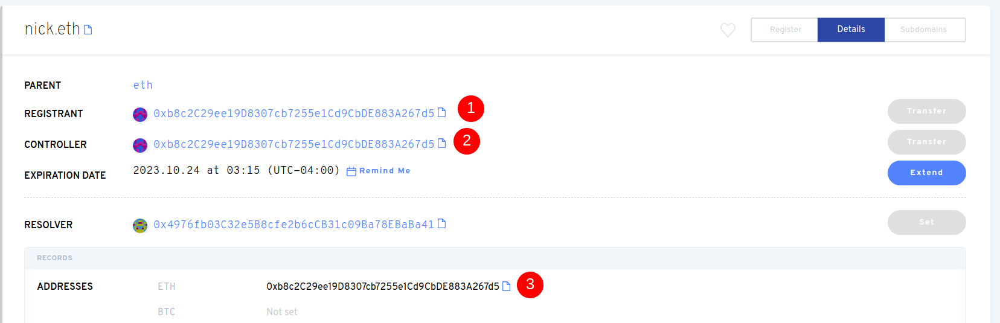

# Передать право собственности на ЭНС

Чтобы передать владельцу имя ENS на другой кошелек, подключитесь к приложению ENS. Кошелёк, указанный в качестве регистратора, является **владельцем** имени ENS. На скриншоте ниже (1) указывает регистратора.

Во время входа в приложение ENS с кошельком регистрации, вы сможете нажать "Перенос", и введите адрес кошелька, чтобы передать имя владельца ENS.

Тем не менее, контроллер является кошельком, который может обновлять другие записи, как ETH адрес (см. #3 на изображении выше). Перенос регистратора на новый кошелек _не обновляет автоматически_ адрес контроллера (см. #2 на скриншот), и не изменяет адрес платежа ETH. Это отдельные транзакции, которые будут стоить обновления газа.

Некоторые пользователи могут захотеть полностью передать имя на другой кошелек и иметь те же записи по умолчанию, как если бы этот новый кошелек зарегистрировал название. Для этого контроллер должен сначала обновить ETH адрес (см. #3) на новый адрес кошелька. После того, как это будет изменено, кошелек Регистратора должен будет обновить контроллер записи на тот же новый адрес кошелька. Наконец, Секретарь должен передать право собственности на новый кошелек. Таким образом, имя полностью передается в новый кошелек, и этому получателю не нужно делать дополнительных настроек, кроме настройки их первичного имени. Последовательность этого процесса имеет значение. Если к примеру, регистратор сначала передается на новый кошелек, то только новый кошелек может обновить контроллер.

**Важно:** Без обновления ETH адреса, токены отправлены _другому. th_ все равно прибудет в исходный кошелек, если только регистратор был изменен!

<!-- ### Further Reading:

* [Setting Your Primary Name](setting-your-primary-name.md) 
-->
