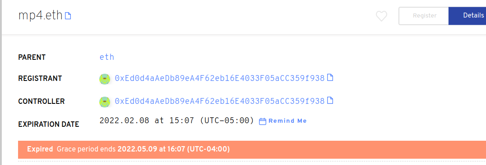
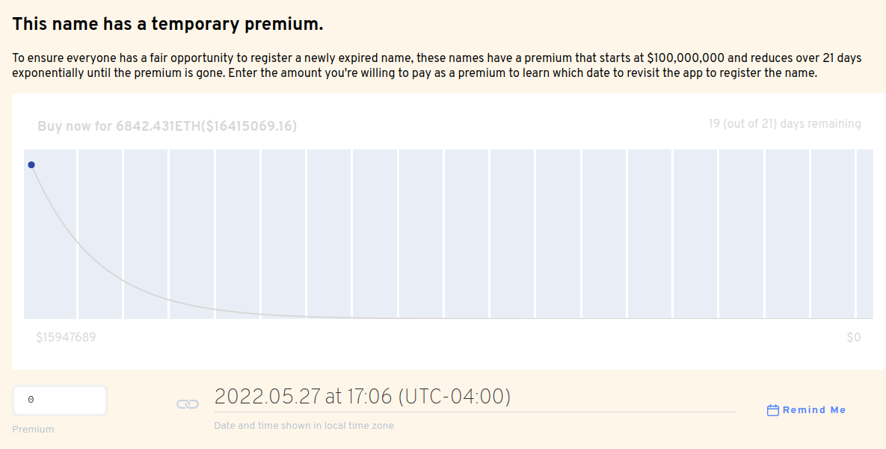

# Что такое льготный период?

**Льготный период** - это 90-дневный промежуток времени, который дается по истечении имени ENS. За это время имя не может быть передано новому Регистратору (владельцу) и записи не могут быть обновлены. Имя ENS должно быть обновлено для того, чтобы оставить льготный период и срок действия его действия в будущем.

Если название ENS не будет продлено до истечения льготного периода, название будет указано на премиальный голландский аукцион в течение 21 дней. В конце 21 дня название ЭНС не будет иметь больше премии и может быть зарегистрировано по стандартной годовой плате. В настоящее время премиальный аукцион начинается с $100 000 000 000 долларов США и уменьшается при нелинейном разрыве в 21 день. Если наименование приобретено в течение премиального периода, покупатель оплачивает премиальную цену аукциона и стандартную ежегодную плату.

### Дальнейшее чтение:<!-- * \[What is a premium auction?\](what-is-a-premium-auction.md) -->
